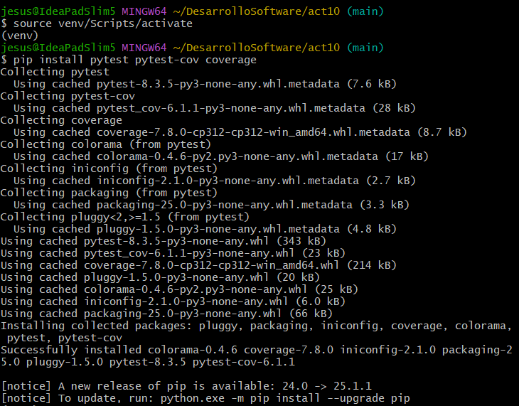
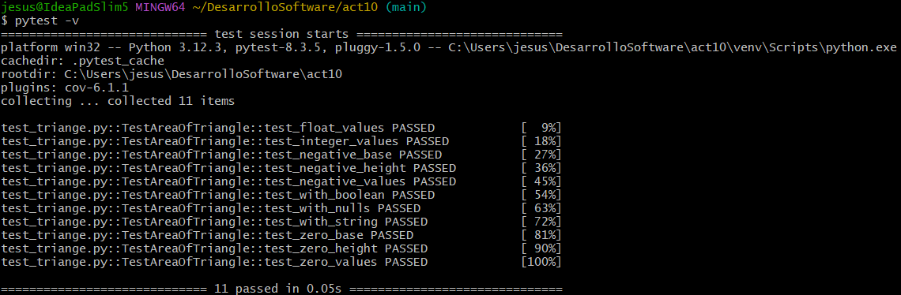
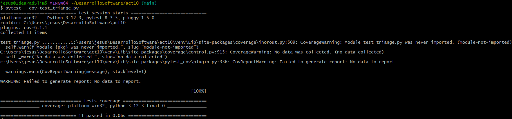
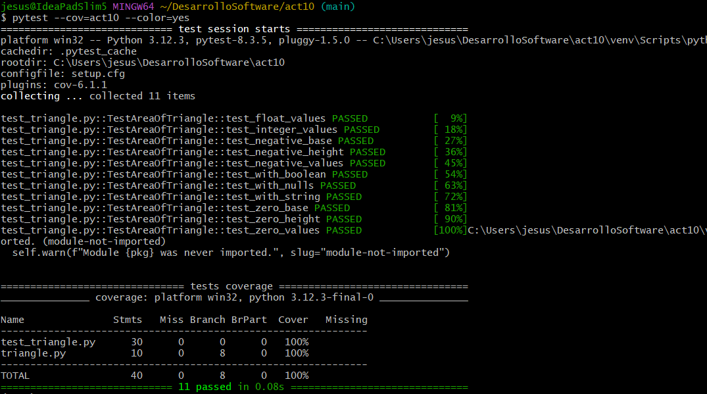
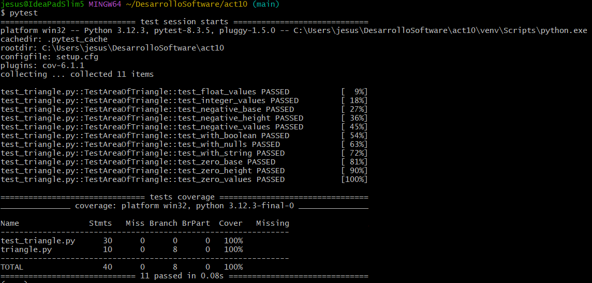

# Actividad 10: Ejecución de pruebas con pytest

- Para esto activamos un entorno virtual e instalamos las dependencias necesarias, como  `pytest` `pytest-con` y `coverage`.

    

- Al ejecutar `pytest -v` corremos las pruebas que tenemos en `test_triangle.py`.

    

    `-v` activa el modo detallado, donde nos muestra que pruebas se ejecturon y sus resultados.

- Ahora añadiendo cobertura a nuestras pruebas

    

    Vemos que nos bota que la cobertura es del 100%, es decir que nuestras pruebas abarcan con todas las funcionalidades y líneas en `triangle.py`.

    - Si desamos un informe más detallado, donde mustre que líneas no están cubiertas, podríamos usar 

    ```bash
    pytest --cov=triangle --cov-report=term-missing
    ```
    pero en nuestro caso no es necesario ya que tenemos una cobertura del 100%.

    - Ahora si deseamos un informe en HTML con los mismos detalles vistos, ejecutamos 
    ```bash
    pytest --cov=triangle --cov-report=term-missing --cov-report=html
    ```

    Y esto crea una carpeta `/htmlcov` donde se encuentran todos los resultados.

- Pytest viene con un soporte de colores por defecto, color verde indica que la prueba a pasado y color rojo que están fallando. Si los colores no se muestran (como es mi caso), lo forzamos con la opción `--color=yes`

    

    Vemos que todo está de verde, es decir, que todas las pruebas pasaron satisfactoriamente.

- Para automatizar la configuración de pytest, en lugar de escribir todos los parámetros de configuración cada vez que se ejecute pytest, podemos guardalo en un archivo pytest.ini o como en este ejemplo setup.cfg.

    ```
    # Ejemplo de setup.cfg usado
    [tool:pytest]
    addopts = -v --tb=short --cov=. --cov-report=term-missing

    [coverage:run]
    branch = True

    [coverage:report]
    show_missing = True
    ```

    La diferencia entre estos archivos radica en su propósito, alcance y sintaxis. Mientras que un archivo `pytest.ini` tiene una configuración exclusiva para pytest, usa `pytest` directamente y se usa en proyectos centrados en pruebas, un archivo `setup.cfg` tiene una configuración de múltiples herramientas(pytest, flake, coverage, etc), usa `[tool:pytest]` para opciones de pytest y se usa en proyectos complejos con muchas herramientas.

- Una vez implementado nuestro archivo `setup.cfg`, es suficiente ejecutar `pytest` para que se muestre las pruebas con los parámetros definidos en el archivo de configuración

    