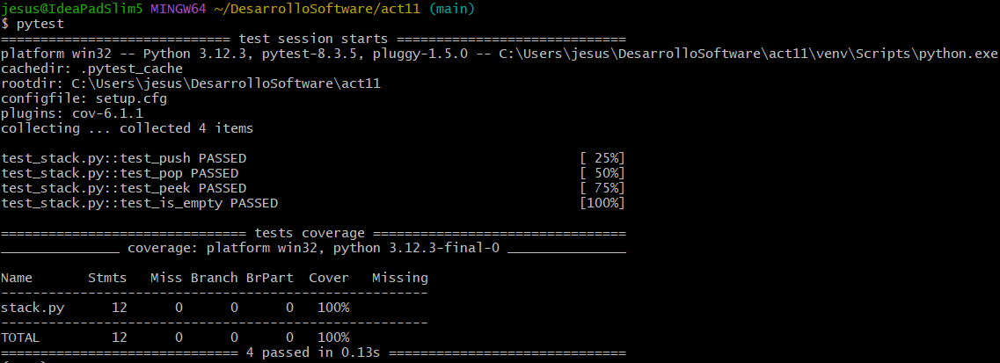

# Actividad 11: Aserciones en pruebas con pytest

- Comenzamos iniciando un entorno virtual e instalando las dependencias necesarias.

    

- Inicialmente `test_stack.py` tiene las pruebas escritas con `unittest` y vemos que las pruebas pasan.

    

- Ahora lo que haremos es pasar las pruebas a `pytest` con assert. También tenemos variaciones de estos métodos pero que están escritos en `unittest` lo cual no pasará ya que habrá una mezcla de estilos y errores de sintaxis.

- Una vez pasado las pruebas a `pytest` deben pasar, para esto mostramos la cobertura del código. Solo ejecutamos `pytest` y obtendremos todos los parámetros configurados en nuestro archivo `setup.cfg`.

    