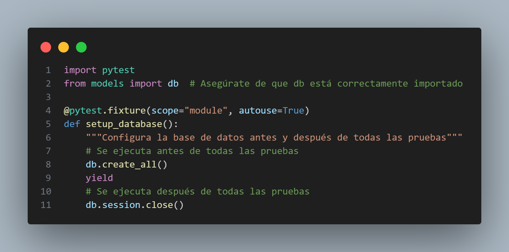
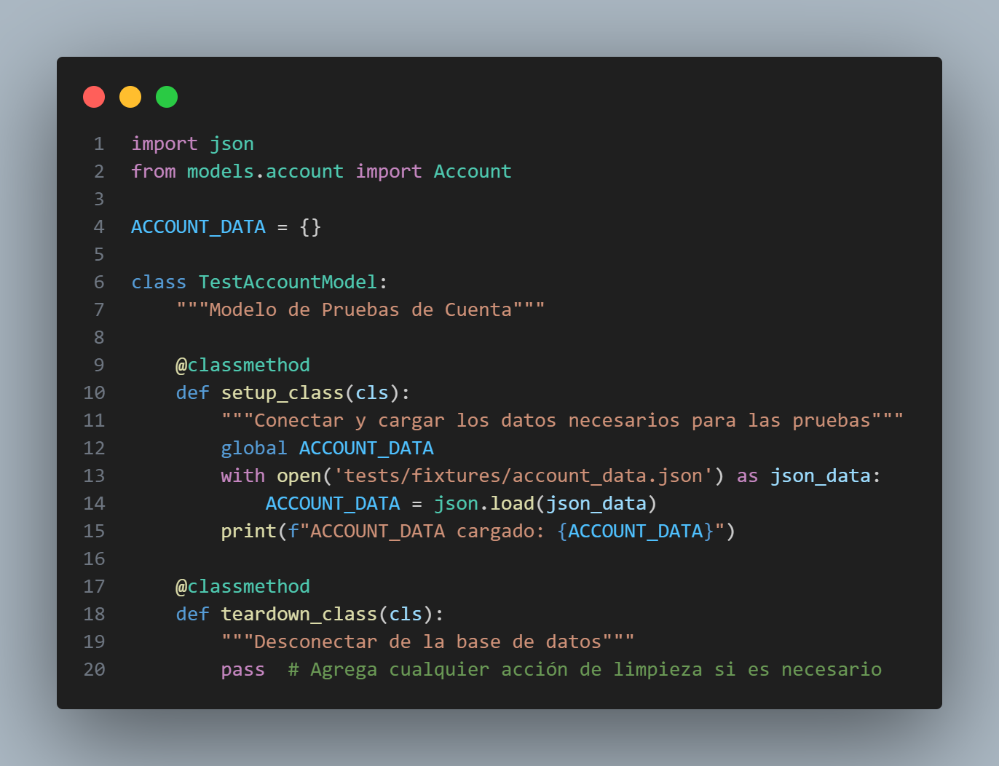
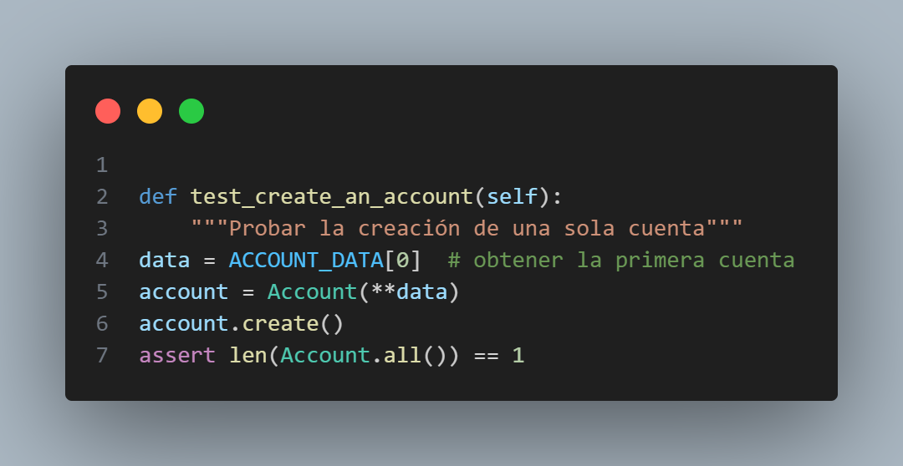
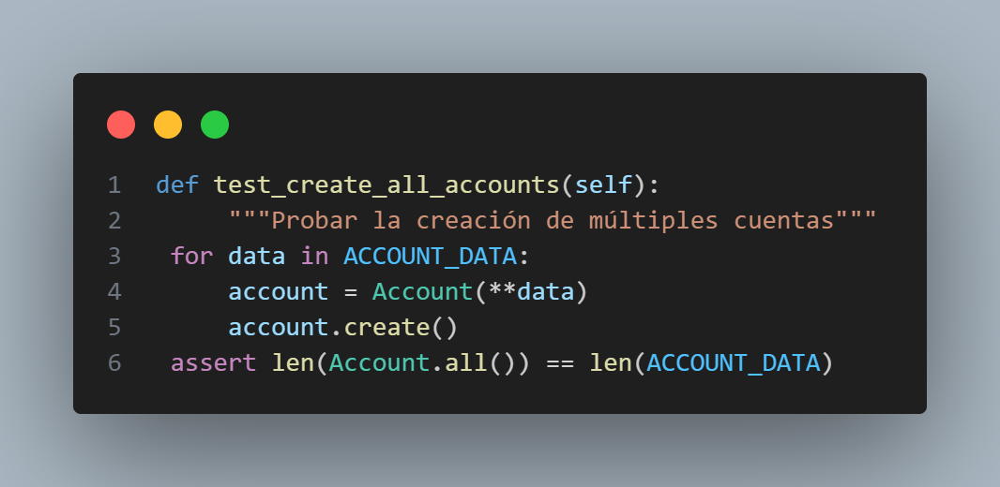
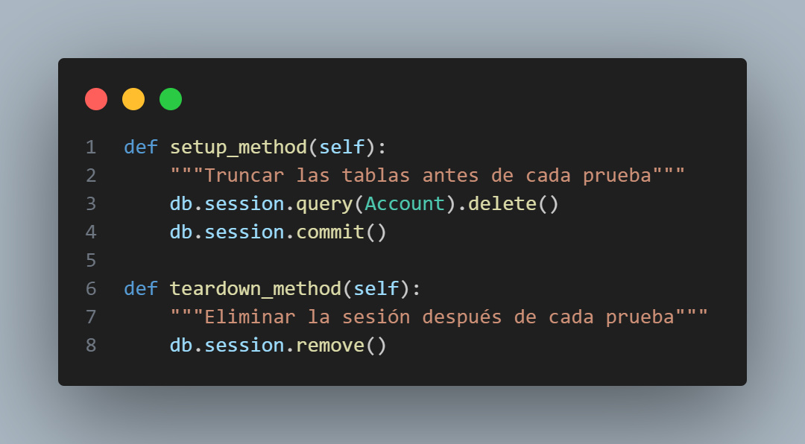
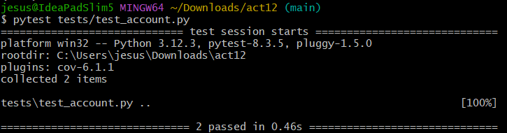
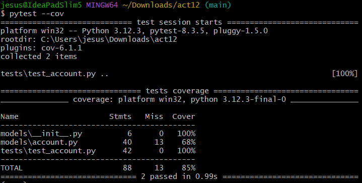

# Actividad 12: Revisión de fixtures en pruebas

## 1. Inicializamos la base de datos

Configuramos un fixture de prueba para conectar y desconectar de la base de datos.

- `scope = "module":` Nos indica que este fixture se ejecuta una vez para todo el módulo.
- `autouse=True:` Hace que se ejecute automáticamente sin necesidad de inyectarlo en las funciones de prueba.
- `db.create_all():` Crea todas las tablas definidas en la base de datos 
- `yield:` Pausa la ejecución del fixture y permite que se ejecuten todas las pruebas
- `db.session.close():` Cierra la conexión a la base de datos después de que todas las pruebas hayan finalizado

## 2. Cargamos datos de prueba

Cargamos algunos datos de prueba que serán usados durante las pruebas. Solo es necesario hacerlo una vez.

- Primero definimos `ACCOUNT_DATA` como variable global que contendrá los datos de prueba.

- Creamos la clase `TestAccountModel` que contendrá todas nuestras pruebas.

- Implementamos el método `setup_class` que declara que usará la variable global, abre el archivo JSON que contiene los datos de prueba, carga los datos en la variable global e imprime los datos cargados.

- Incluímos también el método `teardown_class` vacío, ya que el fixture de nivel de módulo se encargará de cerrar la conexión a la base de datos.

## 3. Escribimos un caso de prueba para crear una cuenta

Creamos una cuenta utilizando el diccionario `ACCOUNT_DATA`.

- Creamos una instancia de la clase `Account` pasando los datos como argumentos con notación de desempaquetado `(**data)`.
- Llamamos al método `create()` de la instancia para guardarla en la base de datos.
- Verificamos que la función `Account.all()` devuelve exactamente una cuenta, lo que confirmaría que la cuenta fue creada correctamente.

## 4. Escribimos un caso de prueba para crear todas las cuentas 

Luego de verificar que se puede crear una sola cuenta, escribimos una prueba que cree todas las cuentas del diccionario `ACCOUNT_DATA`.

- Utilizamos un bucle `for` para iterar sobre todos los elementos en `ACCOUNT_DATA`.
- Para cada elemento, creamos una instancia de la clase `Account` y llamamos al método `create()` para guardarla en la base de datos.
- Al final, verificamos que el número de cuentas en la base de datos (`len(Account.all())`) coincide con el número de elementos en `ACCOUNT_DATA`.

## 5. Limpiamos las tablas antes y después de cada prueba

Nuestras pruebas fallan y esto es debido a que los datos de prueba anteriores están afectando el resultado de las siguientes pruebas. Así que agregamos métodos que limpien las tablas antes y después de cada prueba.

- El método `setup_method` se ejecutará automáticamente antes de cada método de prueba, eliminará todos los registros de la tabla `Account` usando `db.session.query(Account).delete()` y confirmará esta operación con `db.session.commit()`.
- El método `teardown_method` se ejecutará automáticamente después de cada método de prueba, eliminando la sesión actual con `db.session.remove()`, lo que libera cualquier conexión de base de datos y recursos asociados.

## 6. Pytest

Luego de hacer estas implementaciones, ejecutamos `pytest` para verificar que las pruebas pasan sin problemas.

Y también mostramos la cobertura de nuestra implementación.

