### **Actividad: Gestión ágil de proyectos con GitHub Projects, configuración de Kanban Board y creación de historias de usuario**

#### Objetivos:

- Configurar y personalizar un Kanban board en GitHub Projects para gestionar el flujo de trabajo de manera eficiente.  
- Crear y utilizar plantillas de issues en GitHub para estandarizar la escritura de historias de usuario.  
- Organizar y priorizar el product backlog mediante la creación, edición y reordenación de historias de usuario en el Kanban board.  
- Realizar el refinamiento del backlog, preparando las historias para el sprint y asegurando la correcta asignación de etiquetas y categorías.  
- Utilizar GitHub Projects como una herramienta efectiva para la planificación, seguimiento y entrega de proyectos ágiles.  


#### Parte 1 - Solución

La realización de este proyecto se realizó de manera grupal, donde mi compañero Christian Luna creo el [kanban-board/Devops-agile](https://github.com/users/Chriss5-2/projects/3/views/1) y nos hizo colaboradores.

El Kanban-board tiene las columnas solicitadas: 

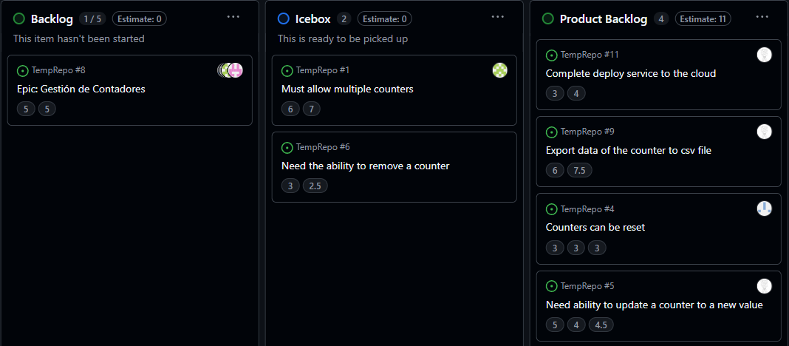

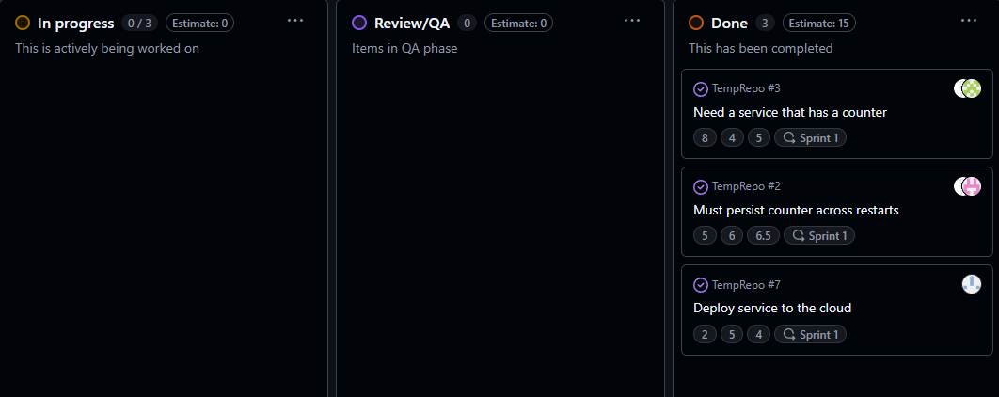

Y cada columna tiene su función.

- **Backlog**: Son historias que se realizaran, tienen una prioridad en el orden en el que aparecen.
- **Icebox**: Son historias que puedne estar en Backlog pero no se sabe si seran trabajadas en corto plazo, pueden ser errores de baja prioridad.
- **Product Backlog**: Historias con prioridad, son las siguientes actividades a realizar. Las que estan mas arriba se realizaran primero y se usaran en iteraciones (Scrum).
- **In Progress**: Historias que tienen un Pull Request asignado y se estan trabajando.
- **Review/QA**: Historias cuyo Pull Request esta siendo revisado, con pruebas que se estan realizando por el equipo de QA o tests adicionales.
- **Done**: Historias resueltas, el Pull Request y su codigo ha sido mergeado a master (main).

#### Parte 2 - Solución

Según el template mostrado, lo usaremos como guía para crear nuestras issues:

```md
---
name: User Story
about: Describe this issue template's purpose here.
title: ''
labels: ''
assignees: ''

---

## User story

As a _(specificrole -e.g, "developer," "admin," "customer")_
I need _(clear functionalit y or feature needed)_
So that _(explain the value or business reason for this feature)_

---

## **Context & Assumptions**
Listany know constraint, assumptions, or dependencies
Mention realted user stories or issues (if applicable).

---

## Aceptance criteria
Scenario: <Short Description>
Given <initial context or system state>
When <user performs an action>
Then <expected outcome or behavior>
And <optional additional conditions>
```

Este archivo markdown se crea en el directorio `.github/ISSUE_TEMPLATE` con el nombre `user_story.md`. Cuando Github detecta archivos markdown en este directorio al crear issues se agrega la siguiente opcion:

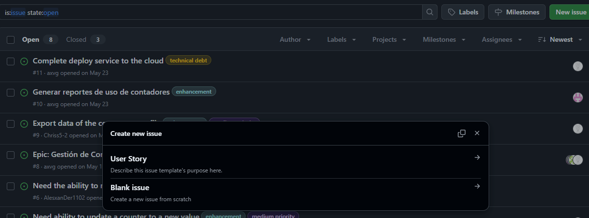

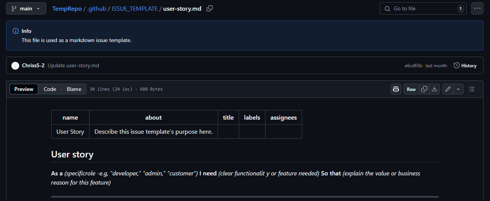

####  Parte 3 - Solución

Creamos 11. Al iniciar estas Issues creados aparecerán en la columna `New Issues` pero posteriormente se moverán a `Product Backlog` y `Icebox`, los otros Issues lo dejaremos en la columna inicial.

<table>
  <tr>
    <td>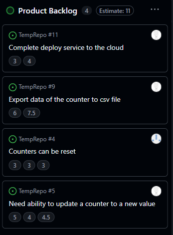</td>
    <td>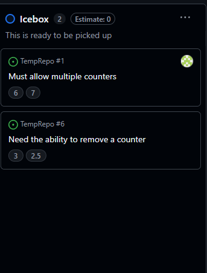</td>
  </tr>
</table>

Para que nuestros Issues creadas aparezcan en el Kanban-board tenemos que asignarle nuestro proyecto `Devops-agile`.

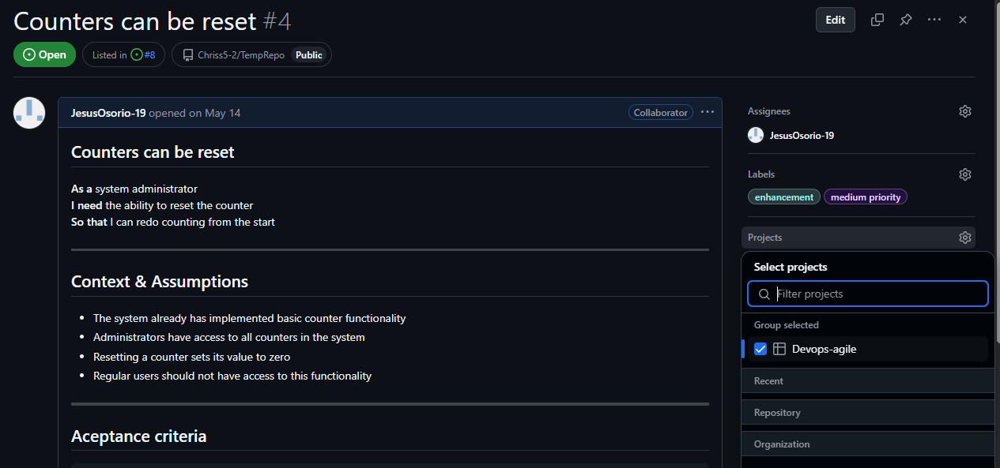

#### Parte 4 - Solución

Para este paso, en las historias que estan en `Product Backlog` como serán las proximas historias a realizar, se necesita información para que el desarrollador sepa que acciones realizar y que criterios serán los cubiertos con el código que realizará, la información a llenar esta definida en el template del paso anterior. De esta manera se tendrá un issue de Github con esta informacion:

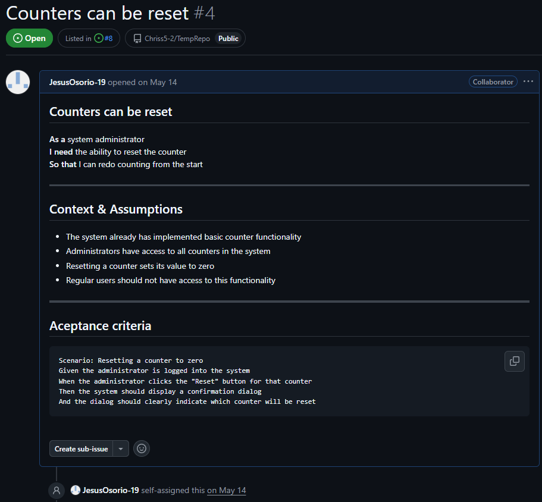

Ademas, como estos issues son nuevos features, se agrega las etiquetas `enhancement` y para el despliegue a la nube `techincal debt` (esta necesita ser creado porque no viene automicamente en Github Projects).


### Ejercicios

##### Ejercicio 1: Crear un Epic y vincular historias de usuario - Solución

Para crear un Epic en Github Project, se creara un issue y se asignara el titulo con `Epic: Gestión de Contadores`, dentro de la descripcion de esta issue se pondran las dependencias para esta Epic, en este caso se usa la sintaxis de Github Project, esto es, para enlazar a esta Epic la issue `Need a service that has a counter #3`, solo se agrega `#3` y automaticamente se enlaza en el formato markdown de Github. Ademas se usan checkbox para mostrar si una issue esta cerrada o abierta. 

La Epic quedara de la siguiente manera:

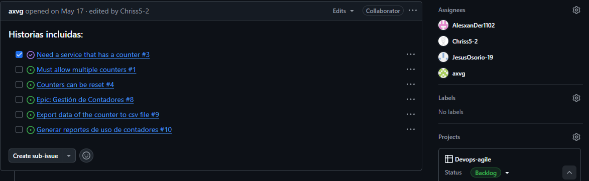

##### Ejercicio 2: Uso avanzado de etiquetas (labels) para priorización y estado - Solución

Para este ejercicio, se agregaran las etiquetas en [TempRepo](https://github.com/Chriss5-2/TempRepo/issues/labels), que es el repositorio del grupo.

Aca aparecera una lista de las labels que se tienen para este proyecto.

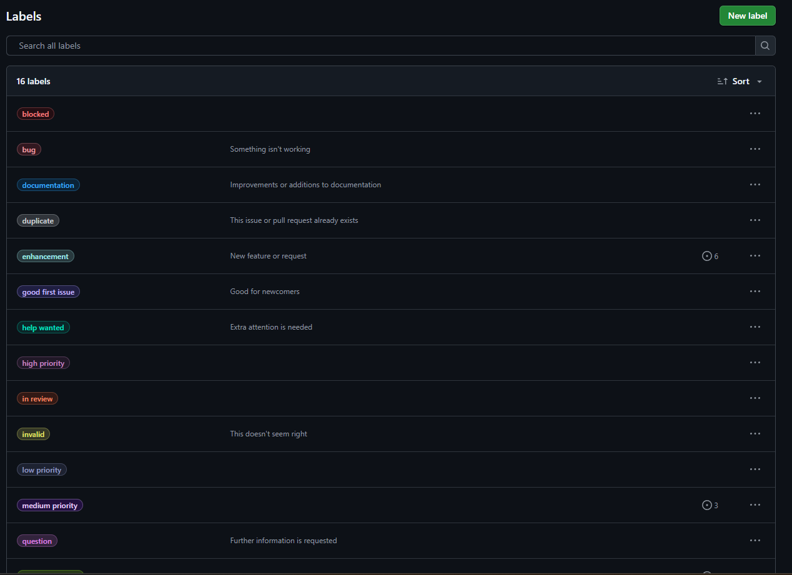

Para agregar un label, se hace click en `New Label` y se abrirá el siguiente menu:

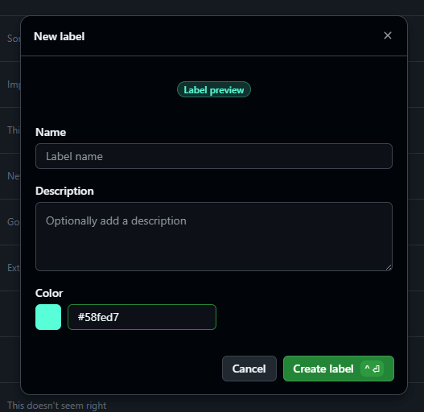

Para un nuevo label se necesita darle un nombre, color y opcionalmente una descripción.

##### Ejercicio 3: Automatización de Kanban board con GitHub Actions - Solución


##### Ejercicio 4: Seguimiento de tiempo y esfuerzo usando GitHub Projects 


##### Ejercicio 5: Refinamiento de backlog basado en comentarios de los stakeholders - Solución

Para este ejercicio, se creará una nueva historia (con información necesario y criterios de aceptación). Esta historia sera la nueva prioridad dentro de la columna `Product Backlog` por lo que estará encima de todas.
> Falta implementar.

##### Ejercicio 6: Análisis del flujo de trabajo usando el Kanban board - Solución

Se va a la opcion `Insights` de este proyecto, dentro de esta se tienen gráficos como `Average _EstimatedTime`, `Average_RealTime`, etc.

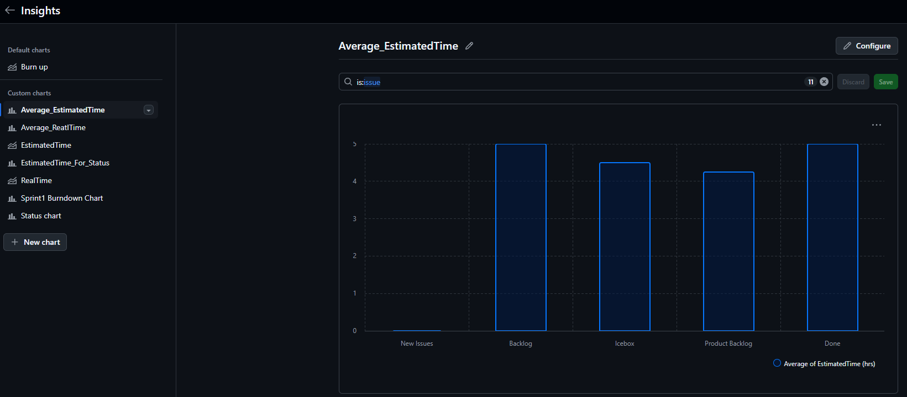

Ademas del número de items en cada columna `Status Chart`:

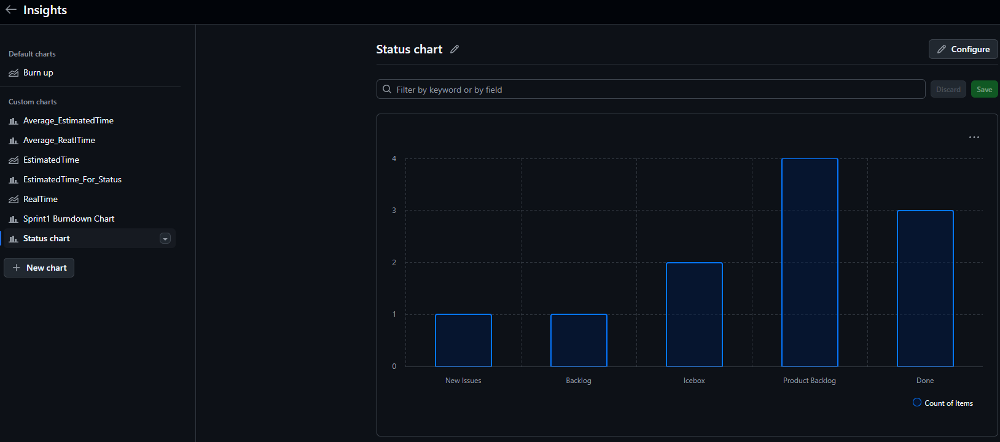

Los cuellos de botella:
- Para la primera grafica son los `Icebox` y columnas `Backlog`, los cuales se podrían mejorar si se clasifican mejor las historias en `Backlog` y se prioriza correctamente con las historias que son más prioritarias y que ocupen menos horas. 
- En la segunda columna se puede ver que hay mas historias en `Product Backlog` por lo que se necesita solucionar la mayor cantidad en la proxima iteracion.