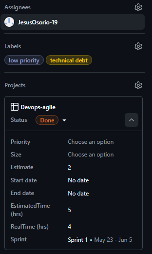
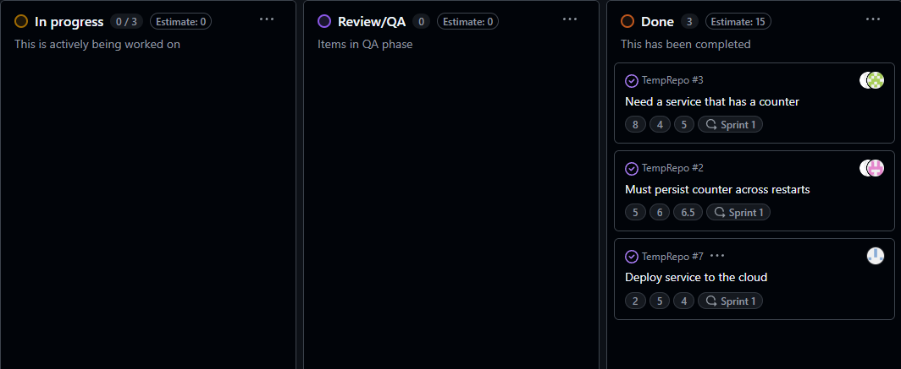
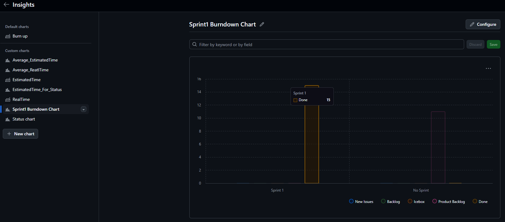
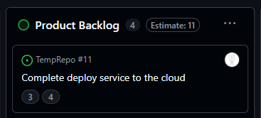

### **Actividad**: Gestión ágil de sprints con GitHub, planificación, ejecución y cierre de Sprints

#### Objetivos:

- Configurar y gestionar sprints en GitHub.  
- Estimar y asignar story points a las historias de usuario.  
- Crear y gestionar el sprint backlog de manera efectiva.  
- Seguir el flujo de trabajo diario para completar las historias.  
- Configurar y analizar un burndown chart para monitorear el progreso del sprint.  
- Cerrar un sprint, gestionar el trabajo incompleto y preparar el backlog para el próximo sprint.   

#### Parte 1 - Solución

Para esta parte, cada integrante del grupo agregó los puntos de historia para cada issue en Github. El sprint se crea con estas 3 historias y 2 adicionales que tendrán puntos pero sin sprint.

Para seleccionar los sprint de cada issue se usa el menú de Github Project y se agrega los dos campos: puntos y sprint. Ademas se puede agregar fecha de inicio y final que esten dentro de las fechas del Sprint seleccionado.

Los issues quedara de la siguiente forma:

Los 3 issues quedarán en la columna Sprint BackLog que vimos en la Actividad17.

#### Parte 2 - Solución

Para esta parte, cada integrante usó un issue de la parte anterior, el proyecto se encuentra en [Devops-agile](https://github.com/users/Chriss5-2/projects/3). Se siguió el flujo normal de una issue hasta su resolución, esto es:

Sprint Backlog ->  In Progress (donde se crea una PR) -> Review/QA (se corren las pruebas necesarias para cumplir las expectativas del feature y cerrar el issue) -> Done

Al terminar las 2 primeras historias, el sprint se termina y queda una tercera por terminar (aunque se trabajo en esta y se usaron puntos), este debe realizarse en la siguiente iteración.

####  Parte 3 - Solución

Para esta parte se realiza la creacion de este grafico, en el siguiente menu [Insights](https://github.com/users/Chriss5-2/projects/3/insights/7). 

El gráfico obtenido es el siguiente, donde se muestra las historias del sprint 1 y las historias que se realizarán en la siguiente iteración (en la columna Product Backlog). La altura de las columnas son por los puntos de historia, de esta manera, tenemos 15 puntos para la columna del sprint 1.

#### Parte 4 - Solución

Del paso 2, se tuvo un issue pendiente. En este caso, el sprint 1 terminó y la historia `Deploy service to the cloud` aún no estaba resuelta. Para solucionarla se crea una nueva historia (issue) y se agrega la etiqueta `technical debt` (deuda técnica). Como se usaron `history points` en el paso 2, para esta historia se agregaronn los puntos restantes (3) y se agrega a la columna `Product Backlog` para realizarla en la próxima iteración.

