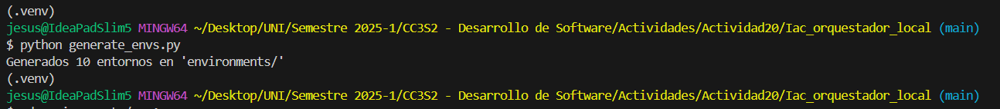
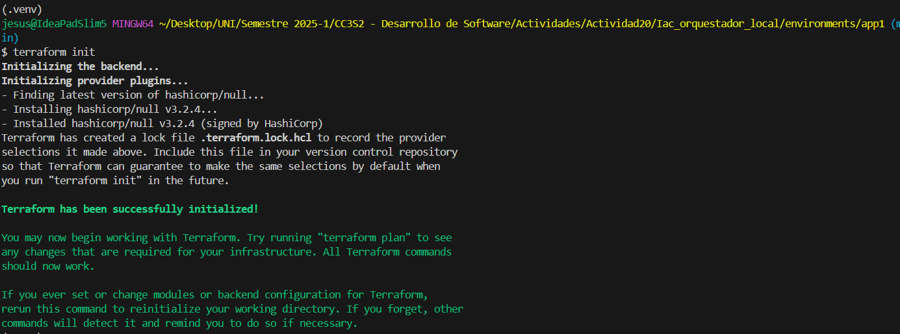
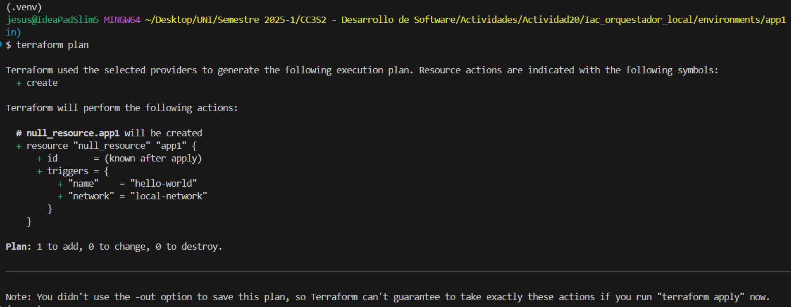
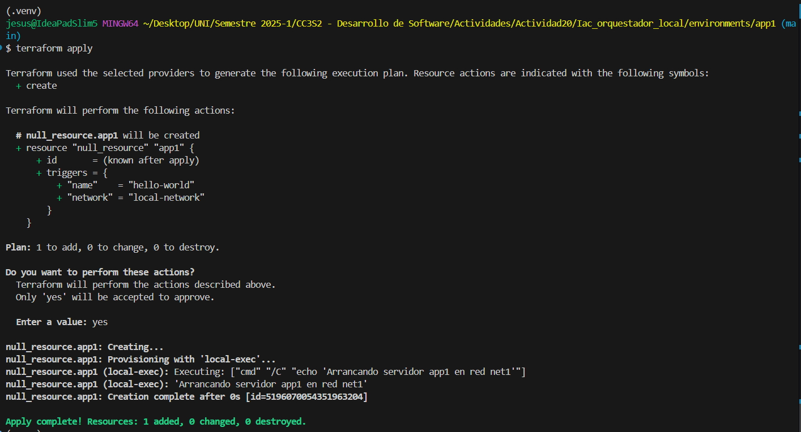
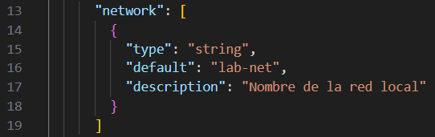
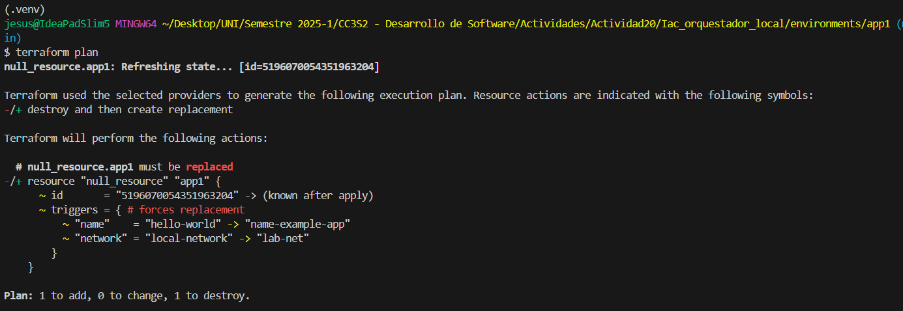

### Actividad: Escribiendo infraestructura como código en un entorno local con Terraform

####  Contexto

Imagina que gestionas docenas de entornos de desarrollo locales para distintos proyectos (app1, app2, ...). En lugar de crear y parchear manualmente cada carpeta, construirás un generador en Python que produce automáticamente:

* **`network.tf.json`** (variables y descripciones)
* **`main.tf.json`** (recursos que usan esas variables)

Después verás cómo Terraform identifica cambios, remedia desvíos manuales y permite migrar configuraciones legacy a código. Todo sin depender de proveedores en la nube, Docker o APIs externas.


#### Fase 0: Preparación 

Al aplicar `python generate-envs.py` se crearon 10 carpetas en `environments\app*` con archivos main.tf.json y network.tf.json.



Entonces, ingresamos a la carpeta `environments/app1` y ejecutamos:

- `terraform init`: para descargar librerias de terraform
    

- `terraform plan`: para ver los cambios que se realizaran
    

- `terraform apply`: para realizar los cambios
    

Además usamos `terraform apply` para crear el archivo `terraform.state` que guarda los cambios que se aplicaron y son necesarios para la siguiente fase.

####  Fase 1: Expresando el cambio de infraestructura - Solución

Al modificar el archivo `modules/simulated_app/network.tf.json`, se cambio la variable `network` de `local-network` a `lab-net`.



Se ejecutó el script de python `python generate_envs.py` que creó nuevamente los archivso `main` y `network` para cada app.

Dentro de `environments/app1` se verificó que en el archivo `network.tf.json`, la variable `network` cambio de `local-network` a `lab-net`.

Se hizo `terraform plan` y se demostró que hubo un cambio de estado, en este caso el nombre de network, como era lo esperado



* **Preguntas**

  * ¿Cómo interpreta Terraform el cambio de variable?
    
    Al ejecutar `plan`, Terraform evalúa los cambios. Cuando una actualización no requiere eliminar y recrear el recurso, este se modifica sin reemplazo (in-place).

  * ¿Qué diferencia hay entre modificar el JSON vs. parchear directamente el recurso?

    Al actualizar el JSON, la jerarquía de directorios se conserva. Sin embargo, con el enfoque anterior (que eliminaba directorios), archivos como `.locl` y `.state` se perdían, rompiendo la coherencia del estado y generando drift.

  * ¿Por qué Terraform no recrea todo el recurso, sino que aplica el cambio "in-place"?

    Terraform evalúa si la modificación puede aplicarse sin destruir el recurso. Solo procede a recrearlo si el cambio afecta atributos no actualizables.

  * ¿Qué pasa si editas directamente `main.tf.json` en lugar de la plantilla de variables?

    Al editar directamente main.tf.json en cada aplicación, los valores quedan estáticos y desvinculados de variables dinámicas, perdiendo flexibilidad y centralización.


#### Fase 2: Entendiendo la inmutabilidad 


#### Fase 3: Escribiendo código limpio en IaC 


#### Fase 4: Integración final y discusión

1. **Recorrido** por:

   * Detección de drift (*remediation*).
   * Migración de legacy.
   * Estructura limpia, módulos, variables sensibles.

2. **Preguntas abiertas**:

   * ¿Cómo extenderías este patrón para 50 módulos y 100 entornos?
    
     Se podría implementar lo siguiente:
     ```py
     dev_dir = os.path.join(env_dir, "dev")
     prod_dir = os.path.join(env_dir, "prod")
        
     os.makedirs(dev_dir, exist_ok=True)
     os.makedirs(prod_dir, exist_ok=True)
     ``` 
     Con el cual se crea dos entornos por aplicación, por ejemplo dentro de `app1`, se tendra directorios `dev` y `prod`.

     Para tener 100 apps, se cambio la lista siguiente que antes creaba 10:

     ```py
      ENVS = [
         {"name": f"app{i}", "network": f"net{i}"} for i in range(1, 51)
     ]
     ```

   * ¿Qué prácticas de revisión de código aplicarías a los `.tf.json`?
   
     Es recomendable utilizar linters y autoformatters para Terraform, como `tflint` o `terraform fmt`. Estas herramientas están integradas en extensiones de editor como `HashiCorp Terraform` para `VSCode`, lo que ayuda a mantener el código consistente y libre de errores sintácticos.    

   * ¿Cómo gestionarías secretos en producción (sin Vault)?

     Para gestionar secretos en Terraform, se puede usar variables con `sensative = true` que evita que el valor se muestre en logs o outputs. Otra opción sería generar archivos `.tf` dinámicamente mediante un script Python que lea secretos de un `.env` (con `os.getenv`).
 
   * ¿Qué workflows de revisión aplicarías a los JSON generados?

     Puedes usar `jq` para dar formato a tus archivos `.tf.json` y automatizar el proceso con un hook pre-commit. Así, antes de cada commit, todos los JSON se estandarizan.

#### Ejercicios

1. **Drift avanzado**

   Se implementó el archivo `drift/main.tf`, en el que el recurso `load_balaner` depende de dos `local_server`, entonces ejecutamos:

   ```sh
    terraform init
    terraform plan
    terraform apply
    ```
    

   Con esto se crearon los archivos `.lock` y `.state`. Despues se cambio el nombre del recurso `local_server_2` a `local_server_3`, al ejecutar:
   
   ```sh
    terraform plan
    ```

   Se observó que no se podria modifcar estos recursos porque no se cumple la condicion para `load_balancer` que es tener `local_server_2`.

    
2. **CLI Interactiva**


3. **Validación de Esquema JSON**


4. **GitOps Local**


5. **Compartición segura de secretos**

