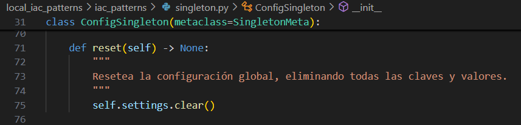

### Actividad: Patrones para módulos de infraestructura

En esta actividad: 
1. Profundizaremos en los patrones **Singleton**, **Factory**, **Prototype**, **Composite** y **Builder** aplicados a IaC.
2. Analizaremos y extenderemos el código Python existente para generar configuraciones Terraform locales.
3. Diseñaremos soluciones propias, escribir tests y evaluar escalabilidad.


#### Fase 0: Preparación
Utiliza para esta actividad el proyecto [local_iac_patterns](https://github.com/kapumota/DS/tree/main/2025-1/local_iac_patterns) como referencia.

1. Activamos nuestro entorno virtual y actualizamos el administrador de paquetes pip a la última versión disponible. 

    

2. Generamos la configuración JSON de Terraform, lo inicamos y validamos.

    

#### Fase 1: Exploración y análisis

##### 1. Singleton

* **Tarea**: Explica cómo `SingletonMeta` garantiza una sola instancia y el rol del `lock`.

    `iac_patterns/singleton.py` 

- La clase _SingletonMeta_ implementa el patrón singleton de manera **thread-safe** usando dos mecanismos clave:

    - Diccionario de instancias 
        ```py
        _instances: Dict[type, "ConfigSingleton"] = {}
        ```
        Almacena una única instancia por clase, comparte memoria ya que todas las llamadas a la clase consultan este diccionario y antes de crear una instancia, verifica si ya existe una instancia.

    - El método call controlado

        ```py
        def __call__(cls, *args, **kwargs):
            with cls._lock:
                if cls not in cls._instances:
                    cls._instances[cls] = super().__call__(*args, **kwargs)
            return cls._instances[cls]
        ```
        Verifica si la clase ya tiene una instancia en `_instances`. Si no existe una instancia lo crea y si existe siempre devolverá la misma instancia.

- El with cls._lock nos garantiza que:
    - Solo un hilo pueda ejecutar la verificación y creación simultáneamente.        
    - La operación _verificar + crear_ sea indivisible.
    - El estado de `_instances` siempre sea coherente.           

    Esta implementación de lock nos garantiza que `ConfigSingleton` tenga solamente una instancia sin importar cuántos hilos se intenten crear en simultáneo.

#### 2. Factory

* **Tarea**: Detalla cómo la fábrica encapsula la creación de `null_resource` y el propósito de sus `triggers`.

    `iac_patterns/singleton.py`

    La  clase `NullResourceFactory` encapsula por completo la creación de recursos Terraform mediante:

    - La abstracción de la complejidad estructural

        ```py
        return {
            "resource": [{
                "null_resource": [{
                    name: [{
                        "triggers": triggers
                    }]
                }]
            }]
        }
        ```

    - Método estático simple
        - Un solo método `create` para todos los recursos.
        - Solo requiere `name` ya que los triggers son opcionales.
        - Factory añade de forma automática triggers que son esenciales.
    
    - La estructura JSON se genera automaticamente. Factory construye la estructura que Terraform espera.

    Los triggers en `null_resource` son fundamentales para el control de estado en Terraform:

    - Detecta cambios
        ```py
        triggers.setdefault("factory_uuid", str(uuid.uuid4()))
        triggers.setdefault("timestamp", datetime.utcnow().isoformat())
        ```
        Esto funciona de la siguiente manera:
        - Compara los valores de triggers entre ejecuciones.
        - Si cualquier trigger cambia, el recurso se recrea.
        - Y si no cambian pues permanecen intacto.

    - Triggers automáticos por defecto
        ```py
        "factory_uuid": "227cdc36-55af-46ad-9449-e23e4ed8dde8"
        ```
        Como vemos en `terraform/main.tf.json` se define un identificador único para todos los bloques de `null_resource`. Esto nos garantiza unicidad de recurso.

        ```py
        "timestamp": "2025-07-02T03:16:45.442007"
        ```
        Tenemos una marca temporal con el propósito de rastrear cuando se generó el recurso y que nos permite forzar recreación basada en tiempo.

#### 3. Prototype

* **Tarea**: Explica cómo el **mutator** permite personalizar cada instancia.

    `iac_patterns/prototype.py`

    - El parámetro `mutator` en el método `clone` implementa un patrón de callback que permite modificar cada clon de forma única y controlada.

        ```py
        def clone(self, mutator=lambda d: d) -> "ResourcePrototype":
        # 1. Crea una copia profunda independiente
        new_dict = copy.deepcopy(self._resource_dict)
        
        # 2. Aplica la función mutadora al clon
        mutator(new_dict)
        
        # 3. Retorna nuevo prototipo con cambios aplicados
        return ResourcePrototype(new_dict)
        ```
        
        Le asigna un valor por defecto, función identidad.
        ```py
        mutator=lambda d: d  # No modifica nada, retorna el dict tal como está
        ```
        Entonces, el mutator es lo que convierte un prototipo estático en un factory flexible de recursos personalizados, manteniendo la integridad del original mientras permite variaciones ilimitadas en los clones.

#### 4. Composite

* **Tarea**: Describe cómo `CompositeModule` agrupa múltiples bloques en un solo JSON válido para Terraform.

    `iac_patterns/composite.py`

    - La clase `CompositeModule` implementa el patrón Composite para unificar recursos individuales de Terraform en una estructura JSON válida.

        ```py
        def __init__(self) -> None:
        self._children: List[Dict[str, Any]] = []
        ```
        Crea una lista para almacenar recursos individuales que puede contener cualquier número de recursos.

        ```py
        def add(self, resource_dict: Dict[str, Any]) -> None:
            self._children.append(resource_dict)
        ```
        Y acá es donde se agrupa los recursos.


#### 5. Builder

* **Tarea**: Explica cómo `InfrastructureBuilder` orquesta Factory -> Prototype -> Composite y genera el archivo JSON final.

    `iac_patterns/builder.py`

    - La clase `InfrastructureBuilder` implementa el patrón Builder que coordina Factory -> Prototype -> Composite en una secuencia fluida generando configuraciones Terraform completas. 

        Flujo de orquestación:
        1. Factory: Recreación del recurso base
            ```python
            # En build_null_fleet()
            base_proto = ResourcePrototype(
                NullResourceFactory.create("placeholder")  # Factory crea el template
            )
            ```
            Se genera un `null_resource` estándar con triggers por defecto, proporciona la estructura base que será clonada múltiples veces y encapsula la complejidad de la estructura JSON de Terraform.

        2. Prototype: Clonación y personalización
            ```python
            for i in range(count):
            def mutator(d: Dict[str, Any], idx=i) -> None:
                res_block = d["resource"][0]["null_resource"][0]
                original_name = next(iter(res_block.keys()))
                new_name = f"{original_name}_{idx}"  # placeholder_0, placeholder_1, etc.
                
                # Renombra y personaliza
                res_block[new_name] = res_block.pop(original_name)
                res_block[new_name][0]["triggers"]["index"] = idx

            clone = base_proto.clone(mutator).data  # Prototype clona y muta
            ```
            Se clona el recurso base sin modificar el original, personaliza cada clon con nombre único (placeholder_0, placeholder_1, etc.) y añade triggers específicos (índice único por recurso).

        3. Composite: Agregación en módulo
            
            ```python
            # Agregamos el recurso clonado al módulo compuesto
            self._module.add(clone)  # Composite agrega cada recurso
            ```
            Se recolecta todos los recursos individuales, mantiene la estructura unificada y prepara para exportación como JSON único.


#### Fase 2: Ejercicios prácticos 

#### Ejercicio 2.1: Extensión del Singleton

* **Objetivo**: Añadir un método `reset()` que limpie `settings` pero mantenga `created_at`.

    - Se añade método `reset()`:
        
        
    
    - Se añade validación, `test_singleton.py`:

        

#### Ejercicio 2.2: Variación de la Factory

* **Objetivo**: Crear `TimestampedNullResourceFactory` que acepte un `fmt: str`.
* **Esqueleto**:

  ```python
  class TimestampedNullResourceFactory(NullResourceFactory):
      @staticmethod
      def create(name: str, fmt: str) -> dict:
          ts = datetime.utcnow().strftime(fmt)
          # TODO: usar ts en triggers
  ```
* **Prueba**: Genera recurso con formato `'%Y%m%d'` y aplica `terraform plan`.

#### Ejercicio 2.3: Mutaciones avanzadas con Prototype

* **Objetivo**: Clonar un prototipo y, en el mutator, añadir un bloque `local_file`.
* **Referencia**:

  ```python
  def add_welcome_file(block: dict):
      block["resource"]["null_resource"]["app_0"]["triggers"]["welcome"] = "¡Hola!"
      block["resource"]["local_file"] = {
          "welcome_txt": {
              "content": "Bienvenido",
              "filename": "${path.module}/bienvenida.txt"
          }
      }
  ```
* **Resultado**: Al `terraform apply`, genera `bienvenida.txt`.

#### Ejercicio 2.4: Submódulos con Composite

* **Objetivo**: Modificar `CompositeModule.add()` para soportar submódulos:

  ```python
  # composite.py (modificado)
  def export(self):
      merged = {"module": {}, "resource": {}}
      for child in self.children:
          if "module" in child:
              merged["module"].update(child["module"])
          # ...
  ```
* **Tarea**: Crea dos submódulos "network" y "app" en la misma export y valida con Terraform.

#### Ejercicio 2.5: Builder personalizado

* **Objetivo**: En `InfrastructureBuilder`, implementar `build_group(name: str, size: int)`:

  ```python
  def build_group(self, name: str, size: int):
      base = NullResourceFactory.create(name)
      proto = ResourcePrototype(base)
      group = CompositeModule()
      for i in range(size):
          def mut(block):  # renombrar
              res = block["resource"]["null_resource"].pop(name)
              block["resource"]["null_resource"][f"{name}_{i}"] = res
          group.add(proto.clone(mut))
      self.module.add({"module": {name: group.export()}})
      return self
  ```
* **Validación**: Exportar a JSON y revisar anidamiento `module -> <name> -> resource`.


