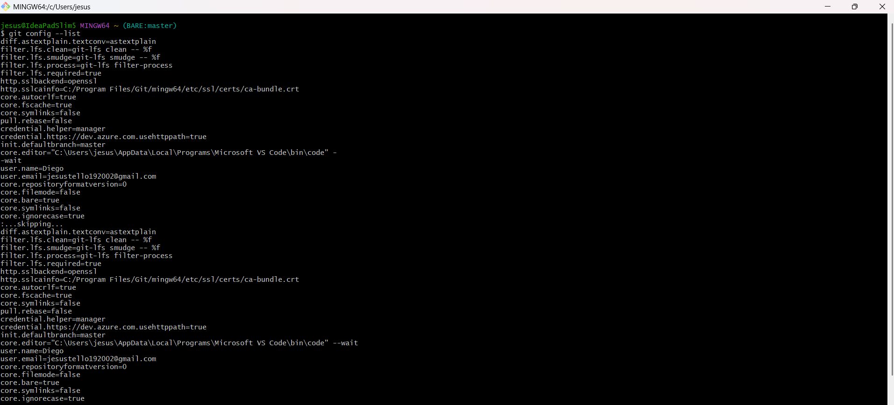
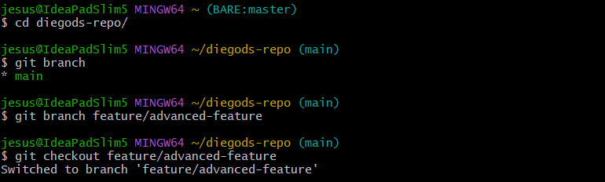
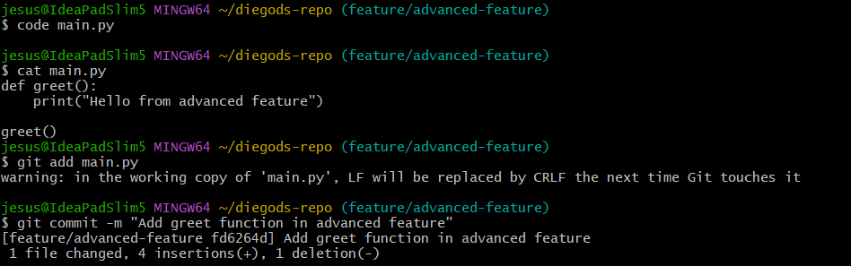
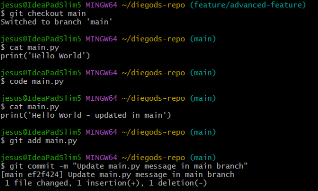
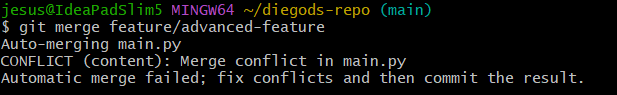
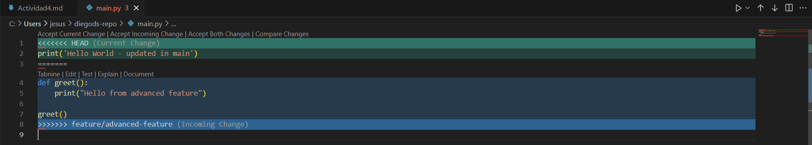
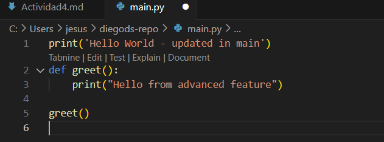
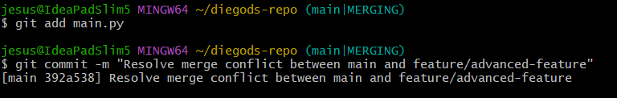
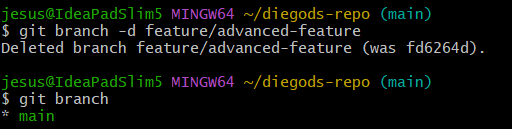

# Actividad 2 - Introducción a Git, conceptos básicos y operaciones esenciales

## Preguntas

**1. ¿Cómo te ha ayudado Git a mantener un historial claro y organizado de tus cambios?**

Git, tanto en este curso como otros, ha sido una herramienta beneficiosa en diferentes aspectos. Como por ejemplo:
**- Commits:** Cada modificación realizada en mi proyecto va acompañado de un mensaje detallado para así saber que cambios hice y el motivo por el cual se hizo. Facilitándome la comprensión de algún proyecto que tenga.

**- Revertir cambios:** Si encuentro un conflicto generado en mi proyecto, gracias a Git puedo revertirlo a una versión anterior y así visualizar el error que he cometido sin comprometer la estructura de mi proyecto.

**- Comparación de versiones:** Gracias al comando git diff puedo revisar las diferencias de código que he realizado en el transcurso, así puedo también identificar algún error que haya cometido.

**- Acceso Remoto:** Gracias a GitHub puedo tener la copia remota de mi repositorio. Así puedo tener acceso a ello desde diferentes lugares y también puedo dar acceso a algún compañero o trabajar juntos con algún grupo de compañeros.

**2. ¿Qué beneficios ves en el uso de ramas para desarrollar nuevas características o corregir errores?**

Una rama es una versión paralela de algún repositorio. Esto nos permite trabajadar en diferentes funciones o correciones sin afectar el código base principal.
- **Aislamiento:** Una rama nos garantiza trabajar un área contenida en el repositorio, sin preocuparnos de los cambios que pueden realizar otras personas en el repositorio.

- **Flujo de trabajo:** Varios desarrolladores pueden trabajar al mismo tiempo en distintas ramas sin causar conflictos entre ellos. Esto permite la colaboración y que se realicen múltiples tareas de manera simultánea, mejorando la productividad del equipo.

- **Control de versiones:** Trabajar en una rama independiente permite realizar pruebas detalladas y revisiones de código antes de integrar los cambios a la rama principal, lo que contribuye a evitar la inclusión de errores en el código estable.

- **Rastreo:** Las ramas permiten rastrear y comparar el código con versiones anteriores. Por ejemplo, si una nueva funcionalidad no funciona como se esperaba, es posible eliminar la rama sin impactar el código base. Esto nos da una gran seguridad y flexibilidad durante el proceso de desarrollo.

- **Experimentación:** En proyectos con lanzamientos frecuentes, las ramas permiten preparar y probar versiones específicas de manera independiente. Cuando una funcionalidad está lista, puede integrarse y desplegarse sin depender de otros cambios en desarrollo.

## Ejercicios

### Ejercicio 1

**1. Crear una nueva rama para una característica:**

- Mi presentación en Git.
  

- Creamos la nueva rama llamada feature/advanced-feature y nos desplazamos a ella.

**2. Modificar archivos en la nueva rama:**

- Editamos el archivo main.py y hacemos git add y git commit.

**3. Simular un desarrollo paralelo en la rama main:**

- Volvemos a la rama main y editamos nuevamente el archivo main.py, luego añadimos y confirmamos el cambio.

**4. Intentar fusionar la rama feature/advanced-feature en main:**

- Fusionamos las dos ramas que tenemos.

**5. Resolver el conflicto de fusión:**

- Al tratar de fusionar, Git generará un conflicto.

- Lo resolvemos manualmente, eligiendo como combinar las dos versiones.

- Una vez resuelto hacemos git add y git commit.

**6. Eliminar la rama fusionada:**

- Una vez fusionada amba ramas, eliminamos la rama `feature/advanced-feature`:

### Ejercicio 2