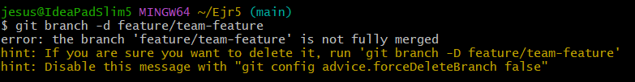

# Actividad 2 - Introducción a Git, conceptos básicos y operaciones esenciales

## Preguntas

**1. ¿Cómo te ha ayudado Git a mantener un historial claro y organizado de tus cambios?**

Git, tanto en este curso como otros, ha sido una herramienta beneficiosa en diferentes aspectos. Como por ejemplo:
**- Commits:** Cada modificación realizada en mi proyecto va acompañado de un mensaje detallado para así saber que cambios hice y el motivo por el cual se hizo. Facilitándome la comprensión de algún proyecto que tenga.

**- Revertir cambios:** Si encuentro un conflicto generado en mi proyecto, gracias a Git puedo revertirlo a una versión anterior y así visualizar el error que he cometido sin comprometer la estructura de mi proyecto.

**- Comparación de versiones:** Gracias al comando git diff puedo revisar las diferencias de código que he realizado en el transcurso, así puedo también identificar algún error que haya cometido.

**- Acceso Remoto:** Gracias a GitHub puedo tener la copia remota de mi repositorio. Así puedo tener acceso a ello desde diferentes lugares y también puedo dar acceso a algún compañero o trabajar juntos con algún grupo de compañeros.

**2. ¿Qué beneficios ves en el uso de ramas para desarrollar nuevas características o corregir errores?**

Una rama es una versión paralela de algún repositorio. Esto nos permite trabajadar en diferentes funciones o correciones sin afectar el código base principal.
- **Aislamiento:** Una rama nos garantiza trabajar un área contenida en el repositorio, sin preocuparnos de los cambios que pueden realizar otras personas en el repositorio.

- **Flujo de trabajo:** Varios desarrolladores pueden trabajar al mismo tiempo en distintas ramas sin causar conflictos entre ellos. Esto permite la colaboración y que se realicen múltiples tareas de manera simultánea, mejorando la productividad del equipo.

- **Control de versiones:** Trabajar en una rama independiente permite realizar pruebas detalladas y revisiones de código antes de integrar los cambios a la rama principal, lo que contribuye a evitar la inclusión de errores en el código estable.

- **Rastreo:** Las ramas permiten rastrear y comparar el código con versiones anteriores. Por ejemplo, si una nueva funcionalidad no funciona como se esperaba, es posible eliminar la rama sin impactar el código base. Esto nos da una gran seguridad y flexibilidad durante el proceso de desarrollo.

- **Experimentación:** En proyectos con lanzamientos frecuentes, las ramas permiten preparar y probar versiones específicas de manera independiente. Cuando una funcionalidad está lista, puede integrarse y desplegarse sin depender de otros cambios en desarrollo.

## Ejercicios

### Ejercicio 1: Manejo avanzado de ramas y resolución de conflictos

**1. Crear una nueva rama para una característica:**

- Mi presentación en Git.
  

- Creamos la nueva rama llamada feature/advanced-feature y nos desplazamos a ella.

**2. Modificar archivos en la nueva rama:**

- Editamos el archivo main.py y hacemos git add y git commit.

**3. Simular un desarrollo paralelo en la rama main:**

- Volvemos a la rama main y editamos nuevamente el archivo main.py, luego añadimos y confirmamos el cambio.

**4. Intentar fusionar la rama feature/advanced-feature en main:**

- Fusionamos las dos ramas que tenemos.

**5. Resolver el conflicto de fusión:**

- Al tratar de fusionar, Git generará un conflicto.

- Lo resolvemos manualmente, eligiendo como combinar las dos versiones.

- Una vez resuelto hacemos git add y git commit.

**6. Eliminar la rama fusionada:**

- Una vez fusionada amba ramas, eliminamos la rama `feature/advanced-feature`:

### Ejercicio 2: Exploración y manipulación del historial de commits

**1. Ver el historial de commits:**

- Vemos el historial de commits con `gitl log` 

- Los cambios que se han realizado son básicamente de los ejemplos de la Actividad 4 y el Ejercicio 1.

**2. Filtrar commits por autor:**

**3. Revertir un commit:**

- Al querer revertir el último commit más reciente de main.py, sería el de fusión de ramas, así que `git revert HEAD` no seria el comando adecuado, sino `git revert -m 1 HEAD`

- El commit se hizo de manera automática luego de confirmar que es correcto el revertir.

**4. Rebase interactivo:**

- En el editor que se nos abré editamos los dos últimos `pick` y lo reemplazamos por `squash`.

- Pero el `rebase` no sigue porque hay un conflicto con el archivo main.py ya que al eliminar el último commit de este se modificó la fusión entre las ramas.

- Asi que lo resolvemos manualmente y le hacemos `git add`, luego colocamos `git rebase --continue` para que continue con el rebase interactivo.

- Se abrirá dos editores de VScode automaticamente confirmando los commits que se realizará. 

- Verificamos que el `git rebase` a concluido

**5. Visualización gráfica del historial:**

### Ejercicio 3: Creación y gestión de ramas desde commits específicos

**1. Crear una nueva rama desde un commit específico**

- Identificamos un commit antiguo desde el cual crearemos una nueva rama (`bugfix/rollback-feature`) y nos trasladamos hacia esa nueva rama.

**2. Modificar y confirmar cambios en la nueva rama:**

- Realizamos algunas modificaciones en el archivo `main.py` y luego hacemos `git add` y `git commit`.

**3. Fusionar los cambios en la rama principal:**

- Regresamos a la rama `main` y fusionamos la rama `bugfix/rollback-feature`, se generará un conflicto y lo resolvemos manualmente para que la fusión se complete. 

**4. Explorar el historial después de la fusión:**

**5. Eliminar la rama bugfix/rollback-feature:**

### Ejercicio 4: Manipulación y restauración de commits con git reset y git restore

**1. Hacer cambios en el archivo main.py:**

**2. Usar `git reset` para deshacer el commit:**

- Verificamos que el commit este hecho y luego hacemos `git reset`.

- Comprobamos que el cambio en `main.py` se deshizo.

**3. Usar `git restore` para deshacer cambios no confirmados:**

## Ejercicio 5: Trabajo colaborativo y manejo de Pull Requests

**1. Crear un nuevo repositorio remoto:**

- Creamos un nuevo repositorio en GitHub [Repositorio Ejr5](https://github.com/JesusOsorio-19/Ejr5.git) y lo clonamos localmente.

**2. Crear una nueva rama para desarrollo de una característica:**

- Creamos la rama nueva `feature/team-feature`.

**3. Realizar cambios y enviar la rama al repositorio remoto:**

- Creamos un archivo y le realizamos cambios. Luego enviamos la rama al repositorio.

**4. Abrimos un Pull Request:**

- Abrimos el Pull Request de GitHub para fusionar las ramas que tenemos. Luego añadimos una descripción detallada.

**5. Revisar y fusionar el Pull Request:**

- Simulamos la revisión de código y realizamos cualquier cambio necesario para poder fusionar el PR en la rama `main`.

**6. Eliminar la rama remota y local:**

- Al insertar el comando para eliminar la rama local tendremos un error, ya que el PR se ha hecho en GitHub pero no localmente. 

- Entonces actualizamos la rama `main` con los cambios del repositorio remoto y luego de eso podremos eliminar la rama local y remota.

#### Ejercicio 6: Cherry-Picking y Git Stash

**1. Hacer cambios en main.py y confirmarlos:**

**2. Crear una nueva rama y aplicar el `commit` específico:**

- Creamos una nueva rama y aplicamos el `commit` específico para lo cual primero hacemos un `git log` para ver el hash del commit y así hacer el `git cherry-pick`.

**3. Guardar temporalmente cambios no confirmados:**

- Realizamos algunos cambios adicionales en `main.py`, pero no lo confirmamos. Y guardamos los cambios temporalmente con `git stash`.

**4. Aplicar los cambios guardados:**

- Despues de realizar los cambios, recuperamos los cambios guardados previamente con `git stash pop`.

**5. Revisar el historial y confirmar la correcta aplicación de los cambios:**

- Usamos `git log` para revisar el historial de commits y asegurarnos de que los cambios se han aplicado correctamente y por último de que los cambios guardados han sido recuperados.

