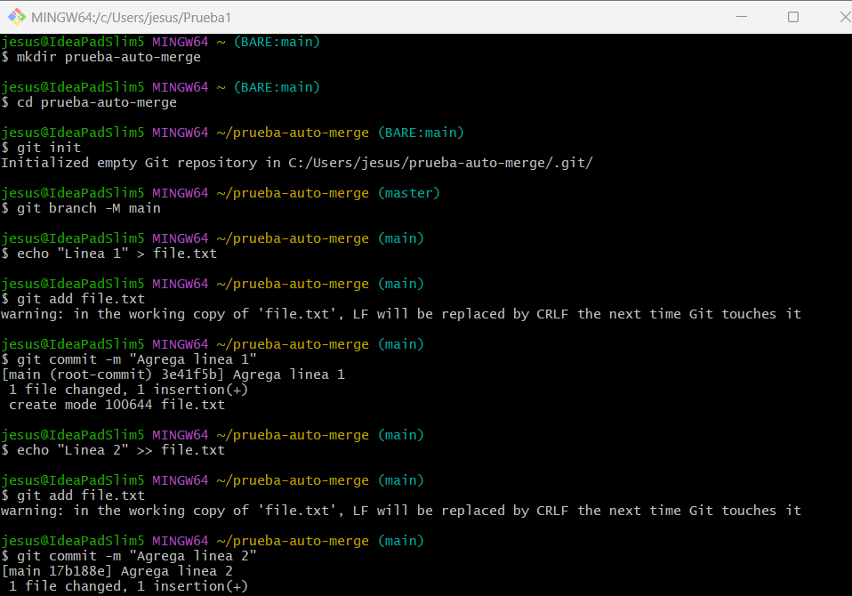

# Actividad 5 - Explorando diferentes formas de fusionar en Git

## Ejemplos 

### 1. Fusión Fast-forward (git merge --ff)

- La fusión fast-forward es la forma más simple de combinar ramas en Git. Solo es posible cuando la rama base no ha recibido nuevos commits desde que se creó la rama feature.

- Mostramos la estructura de commits resultante y el historial del repositorio.

### 2. Fusión No-fast-forward (git merge --no-ff)

- La fusión no-fast-forward crea un nuevo commit de fusión. Es útil para preservar el contexto de la fusión, especialmente en equipos donde se requiere más claridad en el historial de cambios.

- Mostramos el log de commits resultantes y despues el historial del repositorio mostrará un commit de fusión

### 3. Fusión squash (git merge --squash)

- La fusión squash combina todos los cambios de una rama en un solo commit en la rama principal. Este método es útil cuando se quiere mantener un historial de commits limpio.

- Realizamos la fusión `squash` y los commit se aplastarán convirtiéndose en un solo `commit`. Por último, realizamos un `add .` y `commit`.

## Ejercicios

### 1. Clona un repositorio Git con múltiples ramas.

Identifica dos ramas que puedas fusionar utilizando `git merge --ff`.  
Haz el proceso de fusión utilizando `git merge --ff`.  
Verifica el historial con `git log --graph --oneline`. 

**Pregunta:** ¿En qué situaciones recomendarías evitar el uso de `git merge --ff`? Reflexiona sobre las desventajas de este método.

Evitamos usar `git merge --ff` cuando queremos conservar el historial de ramas, ya que `fast-forward` no crea un commit merge lo cual nos hace creer que la rama nunca existió.

### 2. Simula un flujo de trabajo de equipo.

Trabaja en dos ramas independientes, creando diferentes cambios en cada una.  
Fusiona ambas ramas con `git merge --no-ff` para ver cómo se crean los commits de fusión.  
Observa el historial utilizando `git log --graph --oneline`.

- Creamos el nuevo directorio e iniciamos `git`.

- Creamos dos ramas para simular un flujo de trabajo de equipo, en cada rama hacemos cambios en el archivo.

- Hacemos el `merge --no-f` para cada rama. Y luego mostramos el historial.

**Pregunta:** ¿Cuáles son las principales ventajas de utilizar `git merge --no-ff` en un proyecto en equipo? ¿Qué problemas podrían surgir al depender excesivamente de commits de fusión? 

Las ventajas que tenemos es que nos permite identificar fácilmente cuando se integró una nueva función y también poder ver claramente que se hizo en cada rama. Sin embargo depender de esto nos daría problemas como el historial con muchos `merges` el cual se haría más difícil de leer e inclusive más si no describimos bien los commits.

### 3. Crea múltiples commits en una rama.

Haz varios cambios y commits en una rama feature.  
Fusiona la rama con `git merge --squash` para aplanar todos los commits en uno solo.  
Verifica el historial de commits antes y después de la fusión para ver la diferencia. 

- Creamos el nuevo directorio e iniciamos `git`.

- Hacemos varios cambios en un archivo desde una nueva rama.

- Hacemos un `merge --squash` para aplanar todos los commits en uno solo y por último verificamos el historias de commits.

## Ejercicio 1

### Resolver conflictos en una fusión non-fast-forward

En algunos casos, las fusiones no son tan sencillas y pueden surgir conflictos que necesitas resolver manualmente.

1. Inicializamos un nuevo repositorio e iniciamos `git`:

2. Creamos un archivos index.html y realizamos un commit en la rama main:

3. Creamos y cambiamos a una nueva rama. Editamos el archivo y realizamos el commit.

4. Regresamos a la rama main y realizamos una edición al mismo archivo.

5. Fusionamos la rama con `--no-ff` y observamos el conflicto. Lo resolvemos manualmente eliminando las líneas de conflicto generadas por Git (`<<<<<<<`, `=======`, `>>>>>>>`). Agregamos el archivo corregido y completamos la fusión y por último, verificamos el historial para confirmar la fusión y el commit de la resolución de conflictos.

**Preguntas:**
- ¿Qué pasos adicionales tuviste que tomar para resolver el conflicto?

Para arreglar el conflicto tuve que ingresar al archivo y eliminar los símbolos ya mencionados previamente. Luego lo guardé e hice add y commit.

- ¿Qué estrategias podrías emplear para evitar conflictos en futuros desarrollos colaborativos?

Se podría realizar commits más reiteradas veces para ver así cuando es el conflicto o también revisar y entender el historial de cambios.

## Ejercicio 2

### Comparar los historiales con git log después de diferentes fusiones

Este ejercicio nos permitirá observar las diferencias en el historial generado por fusiones fast-forward, non-fast-forward y squash:

1. Creamos un nuevo repositorio y realizamos varios commits en dos ramas:

2. Cambiamos a la rama main y fusionamos feature-1 con fast-forward y luego fusionamos feature-2 con non-fast-forward:

3. Creamos una nueva rama  con múltiples commits y lo fusionamos con squash:

4. Comparamos el historial de Git:

**Preguntas:**
- ¿Cómo se ve el historial en cada tipo de fusión?

Con el primer comando  no aparece el merge tipo fast-forward de feature-1 ya que este no crea un commit de merge. Un merge tipo non-fast-forward de feature-2 si aparece  y por último el merge tipo squash de feature-3 tampoco aparece ya que genera un commit normal.

Y con el último comando vemos todo el historial con todas las ramas y commits.

- ¿Qué método prefieres en diferentes escenarios y por qué?

    - El `-ff` lo usaría para cuando haya cambios simples como errores o documentación.

    - El `--no-ff` para cuando una rama tiene multiples commits y necesito ver alguna parte específica de los commits realizados.

    - El `squash` para mantener un historial limpio.

## Ejercicio 3

### Usando fusiones automáticas y revertir fusiones

En este ejercicio, aprenderemos cómo Git puede fusionar automáticamente cambios cuando no hay conflictos y cómo revertir una fusión si cometes un error.

1. Inicializamos un nuevo repositorio y realizamos dos commits en main:

2. Creamos una nueva rama auto-merge y realizamos otro commit en file.txt:

3. Volvemos a min y realizamos cambios no conflictivos en otra parte del archivo, en este caso lo añadimos al lado de Linea 1, para que no se genere conflictos:

4. Fusionamos la rama auto-merge con main y se debe fusionar los cambios automáticos sin conflictos. Luego revertimos la fusión por si decidimos que la fusión fue un error.

**Preguntas:**
- ¿Cuándo usarías un comando como git revert para deshacer una fusión?

Lo usaría para cuando cometa una fusión erróneamente.

- ¿Qué tan útil es la función de fusión automática en Git?

Creo que debe ser demasiado útil ya que esto reduce el tiempo de integración  en proyectos con múltiples colaboradores, sin embargo es importante que el equipo revisen los cambios antes de realizar fusiones importantes.

## Ejercicio 4

### Fusión remota en un repositorio colaborativo

Este ejercicio nos permitirá practicar la fusión de ramas en un entorno remoto colaborativo, simulando un flujo de trabajo de equipo.

1. Clonamos un repositorio remoto desde Github o creamos uno nuevo:

2. Creamos una nueva rama y le hacmos algunos cambios:

3. Empujamos los cambios a la rama remota:

Vemos que hay un error, porque no tengo el permiso. Así que tengo que permitir la colaboración.

Ahora si podremos empujar los cambios sin problemas: 

4. Simulamos una fusión desde la rama colaboración en la rama main de otro colaborador. Creamos un Pull Request y realizamos en la fusión.

Revisamos el historial de commits en GitHub y en el entorno también.

**Preguntas:**
- ¿Cómo cambia la estrategia de fusión cuando colaboras con otras personas en un repositorio remoto?

Cambia ya que tenemos que estar en comunicación con el equipo porque los cambios pueden solaparse y llevarnos a errores graves al fusionar ramas.

- ¿Qué problemas comunes pueden surgir al integrar ramas remotas?

Conflictos de fusión, ya que si dos personas realizan cambios en la misma parte de un archivo, Git no puede fusionar los cambios automáticamente y se produce un conflicto. También puede ser problemas con el git pull y el git push, si no se hace git pull regularmente nos podemos encontrar con que la rama local esté desactualizada en relación con la rama remota, lo que nos llevaría a problemas cuando intentemos hacer git push porque Git te impedirá empujar cambios si hay conflictos.