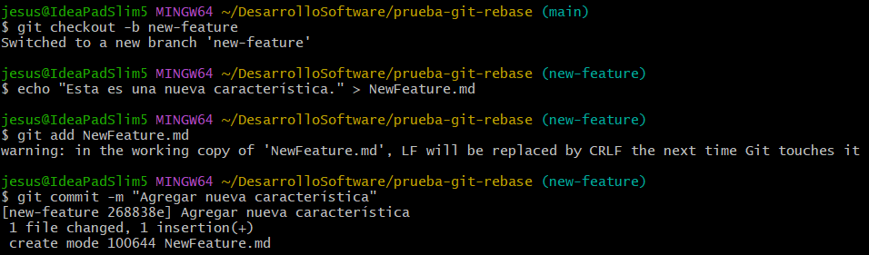
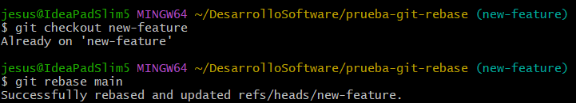

# Actividad 6 - Rebase, Cherry-Pick y CI/CD en un entorno ágil

## Parte 1: git rebase para mantener un historial lineal

1. **Escenario de ejemplo**
    
    - Creamos un nuevo repositorio Git y dos ramas:

    

    - Creamos y cambiamos a la rama new-feature:

    

    - Ahora agregamos nuevos commits a main:

    

    - Realizamos rebase de `new-feature` sobre main:
    
    

    - Visualizamos el historial de commits. Luego fusionamos y completamos el proceso de git rebase:

    

## Parte 2: git cherry-pick para la integración selectiva de commit

1. **Escenario de ejemplo**

    - Inicializamos un nuevo repositorio, agregamos y comiteamos README.md. Luego creamos y cambiamos a una nueva rama. Hacemos cambios en esta nueva rama  y luego echamos un vistazo al log.
    
    
    

2. **Cherry-pick y revisión**

    - Hacemos cherry-pick con el `hash` de nuestro commit de add-base. Luego revisamos el historial.

    

### Preguntas de discusión:

1. **¿Por qué se considera que rebase es más útil para mantener un historial de proyecto lineal en comparación con merge?**

    Porque rebase reescribe el historial de commits al aplicar los cambios de una rama sobre otra de manera secuencial, eliminando ramificaciones en el historial. Esto nos da como resultado un historial más limpio y fácil de entender. En cambio, merge conserva las ramificaciones lo que puede hacer el historial más complejo y difícil de entender.

2. **¿Qué problemas potenciales podrían surgir si haces rebase en una rama compartida con otros miembros del equipo?**

    Recordemos que al hacer rebase se reescribe el historial, es decir, cambia los hashes de los commits. Si otros miembros del equipo ya usaron esa rama entonces se generarán conflictos de sincronización y para solucionar esto es necesario forzar el git push, lo cual puede borrar accidentalmente el trabajo de algún compañero.

3. **¿En qué se diferencia cherry-pick de merge, y en qué situaciones preferirías uno sobre el otro?**

    Mientras que merge une dos ramas completas y sus historias, cherry-pick selecciona commits individuales para aplicarlos en otra rama. 
        
    - Usaría merge cuando deseo combinar el trabajo completo de una rama con otra, preservando el historial y contexto de todos los cambios realizados en la rama.

    - Cherry-pick cuando necesito integrar cambios específicos de una rama sin traer todo su historial.

4. **¿Por qué es importante evitar hacer rebase en ramas públicas?**

    Como ya mencionamos en la respuesta de la pregunta 2, es importante evitar hacer rebase en ramas compartidas con el equipo porque esto reescribe el historial de commits. Si algún miebro del equipo ya ha basado su trabajo en esos commits esto causaría conflictos de sincronización y problemas al fusionar o actulizar sus ramas.

## Ejercicios teóricos

1. **Diferencias entre git merge y git rebase**  
   **Pregunta**: Explica la diferencia entre git merge y git rebase y describe en qué escenarios sería más adecuado utilizar cada uno en un equipo de desarrollo ágil que sigue las prácticas de Scrum.

   - **git merge:**

        Combina dos ramas preservando el historial completo de ambas, incluyendo las ramificaciones. Esto crea un commit de merge que representa la unión de las ramas.

    - **git rebase:**

        Reescribe el historial de commits al aplicar los cambios de una rama sobre otra. Esto elimina ramificaciones en el historial, dándonos un historial más limpio y fácil de seguir.

    Usamos merge cuando se necesita preservar el historial completo y rebase cuando se busca un historial lineal y limpio.

2. **Relación entre git rebase y DevOps**  
   **Pregunta**: ¿Cómo crees que el uso de git rebase ayuda a mejorar las prácticas de DevOps, especialmente en la implementación continua (CI/CD)? Discute los beneficios de mantener un historial lineal en el contexto de una entrega continua de código y la automatización de pipelines.

    Mejora las prácticas ya que git rebase mantiene un historial de commits lineal y limpio. Esto nos facilita la revisión de cambios, la resolución de conflictos y la integración de código.

    - Beneficios en CI/CD
        - Historial limpio
        - Automatización eficiente
        - Colaboración mejorada

3. **Impacto del git cherry-pick en un equipo Scrum**  
   **Pregunta**: Un equipo Scrum ha finalizado un sprint, pero durante la integración final a la rama principal (main) descubren que solo algunos commits específicos de la rama de una funcionalidad deben aplicarse a producción. ¿Cómo podría ayudar git cherry-pick en este caso? Explica los beneficios y posibles complicaciones.

    Cherry-pick en este caso nos permite integrar únicamente los commits necesarios con su respectivo hash, sin necesidad de fusionar toda la rama.

    - Beneficios:
        - Selección independiente de un commit realizado.
        - Facilitar la integración de cambios sin alterar el resto del trabajo en alguna rama.
        - Control sobre que cambios se aplican y cuándo.
    - Complicaciones:
        - Si los commits elegidos dependen de otros commits no incluidos pueden surgir conflictos.
        - Dificultad en seguimiento del historial si se abusa de esta herramienta.

## Ejercicios prácticos

1. **Simulación de un flujo de trabajo Scrum con git rebase y git merge**

    - Creamos un repositorio y hacemos algunos commits en la rama main.

    

    - Creamos una nueva rama y agregamos nuevos commits.

    

    - Regresamos a la rama main y nuevamente realizamos algunos commits.

    

    - Realizamos un rebase sobre main.

    

    - Y finalmente, realizamos una fusión fast-forward de feature con main.

    

    **Preguntas:**

    - ¿Qué sucede con el historial de commits después del rebase?  

        El commit de main se integra también en el historial de la rama feature.

    - ¿En qué situación aplicarías una fusión fast-forward en un proyecto ágil?

        Usaría la fusión fast-forward cuando la rama que deseo fusionar no tiene commits adicionales desde que se ramificó de la rama main.

2. **Cherry-pick para integración selectiva en un pipeline CI/CD**

    - Creamos un repositorio y hacemos un commit en la rama main.

    

    - Ahora creamos una rama feature y hacemos dos commits para que estén listos para la producción.

    

    - Regresamos a la rama main y realizamos un cherry-pick para cada commit realizado en feature.

    

    **Preguntas:**

   - ¿Cómo utilizarías cherry-pick en un pipeline de CI/CD para mover solo ciertos cambios listos a producción?  

        Primero identificaría los commits que deben ser movidos a producción, luego ejecutar el comando `git cherry-pick <hash>` en la rama main para aplicar los cambios, verificar que se hizo correctamente y continuaos con el pipline de CI/CD.

   - ¿Qué ventajas ofrece cherry-pick en un flujo de trabajo de DevOps?

        - Nos ofrece varias ventajas, especialmente cuando se requiere mover cambios específicos a producción o a una rama principal sin fusionar todo el historial de una rama.
            - Permite aplicar solo los commits necesatios evitando así cambios incompletos.
            - Facilita la integración de cambios, sin necesidad de fusionar toda la rama.
            - Mantiene un flujo de trabajo limpio y organizado al integrar solo los cambios listos para producción.

## Git, Scrum y Sprints

### Fase 1: Planificación del sprint (sprint planning)

**Ejercicio 1: Crear ramas de funcionalidades (feature branches)**

- Creamos un repositorio y luego desde la rama principal main creamos una rama para cada historia de usuarui asignada al sprint.

**Pregunta:** ¿Por qué es importante trabajar en ramas de funcionalidades separadas durante un sprint?

Porque así obtenemos una mejor experiencia de trabajo. Por ejemplo:
- Cada funcionalidad tiene su propio espacio de trabajo, lo que evita conflictos entre desarrolladores que trabajan en diferentes tareas.
- Nos permite integrar cambios de manera controlada y progresiva, evitando así conflictos al fusionar con la rama principal.
- Si tenemos algún problema con alguna funcionalidad, podemos retrasar su integración sin perjudicar el resto del proyecto.

### Fase 2: Desarrollo del sprint (sprint execution)

**Ejercicio 2: Integración continua con git rebase**

- Regresamos a la rama main y hacemos algunos commits. Luego realizamos un rebase en `feature-user-story-1` para actualizar su base con los últimos cambios de main.

**Pregunta:** ¿Qué ventajas proporciona el rebase durante el desarrollo de un sprint en términos de integración continua?

El git rebase nos proporciona un historial limpio y lineal, actualizaciones constantes, resolución temprana de conflictos, mejor trabajo en equipo y una fácil integración continua.

### Fase 3: Revisión del sprint (sprint review)

**Ejercicio 3: Integración selectiva con git cherry-pick**

- Realizamos algunos commits en `feature-user-story-2` y luego hacemos un cherry-pick de los commits que estén listos para mostrarse a los stakeholders.

**Pregunta:** ¿Cómo ayuda `git cherry-pick` a mostrar avances de forma selectiva en un sprint review?

Ya que cherry-pick nos permite seleccionar y aplicar commits específicos de una rama a otra, lo cual es útil para mostrar avances de manera selectiva y con esto vemos solo lo relevante.

### Fase 4: Retrospectiva del sprint (sprint retrospective)

**Ejercicio 4: Revisión de conflictos y resolución**

- Realizamos cambios en `feature-user-story-1` y `feature-user-story-2` que resulten en conflictos. Luego intentamos hacer merge de cada rama con main y resolvemos los conflictos

- Aqui resolvimos el conflicto eliminando `<<<<<<<`, `=======` y `>>>>>>>`

**Pregunta**: ¿Cómo manejas los conflictos de fusión al final de un sprint? ¿Cómo puede el equipo mejorar la comunicación para evitar conflictos grandes?

En esta caso lo manejé entrando al archivo donde se generó el conflico y eliminé los cambios marcados (`<<<<<<<`, `=======` y `>>>>>>>`), guardé el archivo he hice git add . y git commit para que termine el merge. Para evitar estos conflictos el equipo debe actualizar regularmente sus ramas con los cambios de la rama principal mediante merge o rebase, tambien dividir las tareas claramente para evitar que varios desarrolladores trabajen en la misma área de código.

### Fase 5: Fase de desarrollo, automatización de integración continua (CI) con git rebase

**Ejercicio 5: Automatización de rebase con hooks de Git**

- Configuramos un hook `pre-push` que hará un rebase automático de la rama main sobre la rama de funcionalidad ates de que el push sea exitoso. Y probamos el hook haciendo push de algunos cambios en la rama `feature-use-story-1`.

[Repositorio: scrum-project](https://github.com/JesusOsorio-19/scrum-project.git)

**Pregunta:** ¿Qué ventajas y desventajas observas al automatizar el rebase en un entorno de CI/CD?

- **Ventajas**
    - Historial limpio y lineal.
    - Resolución rápida de conflictos.
    - Integración continua eficiente
    - Ahorro de tiempo ya que evitamos realizar rebases manuales.

- **Desventajas**
    - Riesgo de generar conflictos al sobreescribir cambios.
    - Conflictos más complejos que serán difíciles de resolver sin intervención manual.
    - Configuración adecuada de hooks o scripts, lo que aumentarí la complejidad inicial del proyecto.