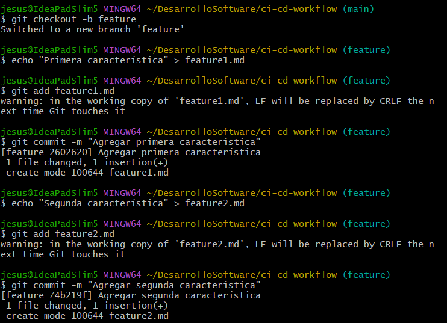
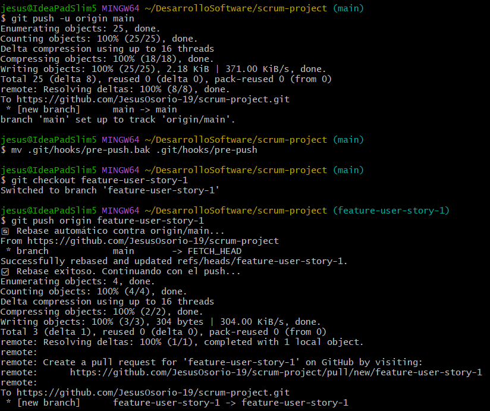

# Actividad 6 - Rebase, Cherry-Pick y CI/CD en un entorno ágil

## Parte 1: git rebase para mantener un historial lineal

1. **Escenario de ejemplo**
    
    - Creamos un nuevo repositorio Git y dos ramas:

    

    - Creamos y cambiamos a la rama new-feature:

    

    - Ahora agregamos nuevos commits a main:

    

    - Realizamos rebase de `new-feature` sobre main:
    
    

    - Visualizamos el historial de commits. Luego fusionamos y completamos el proceso de git rebase:

    

## Parte 2: git cherry-pick para la integración selectiva de commit

1. **Escenario de ejemplo**

    - Inicializamos un nuevo repositorio, agregamos y comiteamos README.md. Luego creamos y cambiamos a una nueva rama. Hacemos cambios en esta nueva rama  y luego echamos un vistazo al log.
    
    
    

2. **Cherry-pick y revisión**

    - Hacemos cherry-pick con el `hash` de nuestro commit de add-base. Luego revisamos el historial.

    

### Preguntas de discusión:

1. **¿Por qué se considera que rebase es más útil para mantener un historial de proyecto lineal en comparación con merge?**

2. **¿Qué problemas potenciales podrían surgir si haces rebase en una rama compartida con otros miembros del equipo?**

3. **¿En qué se diferencia cherry-pick de merge, y en qué situaciones preferirías uno sobre el otro?**

4. **¿Por qué es importante evitar hacer rebase en ramas públicas?**

## Ejercicios teóricos

1. **Diferencias entre git merge y git rebase**  
   **Pregunta**: Explica la diferencia entre git merge y git rebase y describe en qué escenarios sería más adecuado utilizar cada uno en un equipo de desarrollo ágil que sigue las prácticas de Scrum.

2. **Relación entre git rebase y DevOps**  
   **Pregunta**: ¿Cómo crees que el uso de git rebase ayuda a mejorar las prácticas de DevOps, especialmente en la implementación continua (CI/CD)? Discute los beneficios de mantener un historial lineal en el contexto de una entrega continua de código y la automatización de pipelines.

3. **Impacto del git cherry-pick en un equipo Scrum**  
   **Pregunta**: Un equipo Scrum ha finalizado un sprint, pero durante la integración final a la rama principal (main) descubren que solo algunos commits específicos de la rama de una funcionalidad deben aplicarse a producción. ¿Cómo podría ayudar git cherry-pick en este caso? Explica los beneficios y posibles complicaciones.

## Ejercicios prácticos

1. **Simulación de un flujo de trabajo Scrum con git rebase y git merge**

    - Creamos un repositorio y hacemos algunos commits en la rama main.

    

    - Creamos una nueva rama y agregamos nuevos commits.

    

    - Regresamos a la rama main y nuevamente realizamos algunos commits.

    

    - Realizamos un rebase sobre main.

    

    - Y finalmente, realizamos una fusión fast-forward de feature con main.

    

    **Preguntas:**

    - ¿Qué sucede con el historial de commits después del rebase?  
    - ¿En qué situación aplicarías una fusión fast-forward en un proyecto ágil?

2. **Cherry-pick para integración selectiva en un pipeline CI/CD**

    - Creamos un repositorio y hacemos un commit en la rama main.

    

    - Ahora creamos una rama feature y hacemos dos commits para que estén listos para la producción.

    

    - Regresamos a la rama main y realizamos un cherry-pick para cada commit realizado en feature.

    

    **Preguntas:**

   - ¿Cómo utilizarías cherry-pick en un pipeline de CI/CD para mover solo ciertos cambios listos a producción?  
   - ¿Qué ventajas ofrece cherry-pick en un flujo de trabajo de DevOps?

## Git, Scrum y Sprints

### Fase 1: Planificación del sprint (sprint planning)

**Ejercicio 1: Crear ramas de funcionalidades (feature branches)**

- Creamos un repositorio y luego desde la rama principal main creamos una rama para cada historia de usuarui asignada al sprint.

**Pregunta:** ¿Por qué es importante trabajar en ramas de funcionalidades separadas durante un sprint?

### Fase 2: Desarrollo del sprint (sprint execution)

**Ejercicio 2: Integración continua con git rebase**

- Regresamos a la rama main y hacemos algunos commits. Luego realizamos un rebase en `feature-user-story-1` para actualizar su base con los últimos cambios de main.

**Pregunta:** ¿Qué ventajas proporciona el rebase durante el desarrollo de un sprint en términos de integración continua?

### Fase 3: Revisión del sprint (sprint review)

**Ejercicio 3: Integración selectiva con git cherry-pick**

- Realizamos algunos commits en `feature-user-story-2` y luego hacemos un cherry-pick de los commits que estén listos para mostrarse a los stakeholders.

**Pregunta:** ¿Cómo ayuda `git cherry-pick` a mostrar avances de forma selectiva en un sprint review?

### Fase 4: Retrospectiva del sprint (sprint retrospective)

**Ejercicio 4: Revisión de conflictos y resolución**

- Realizamos cambios en `feature-user-story-1` y `feature-user-story-2` que resulten en conflictos. Luego intentamos hacer merge de cada rama con main y resolvemos los conflictos

- Aqui resolvimos el conflicto eliminando `<<<<<<<`, `=======` y `>>>>>>>`

**Pregunta**: ¿Cómo manejas los conflictos de fusión al final de un sprint? ¿Cómo puede el equipo mejorar la comunicación para evitar conflictos grandes?

### Fase 5: Fase de desarrollo, automatización de integración continua (CI) con git rebase

**Ejercicio 5: Automatización de rebase con hooks de Git**

- Configuramos un hook `pre-push` que hará un rebase automático de la rama main sobre la rama de funcionalidad ates de que el push sea exitoso. Y probamos el hook haciendo push de algunos cambios en la rama `feature-use-story-1`.

[Repositorio: scrum-project](https://github.com/JesusOsorio-19/scrum-project.git)

**Pregunta:** ¿Qué ventajas y desventajas observas al automatizar el rebase en un entorno de CI/CD?