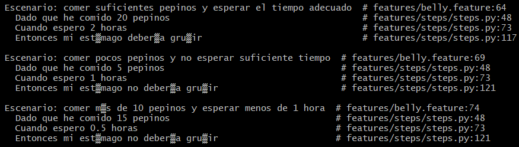

# Actividad 7

## Ejercicios

- Añadimos soporte para minutos y segundos en tiempos de espera. También manejo de cantidades fraccionarias de pepinos.

    

- Soporte para idiomas en Inglés.
    -   Definimos los números en ing y tambien la expresión para extrare horas, minutos y segundos en inglés.
    

    

    - Añadimos escenarios en tiempos con inglés y vemos que si pasan.

    

- Manejamos tiempos aleatorios.

    - Creamos una función que genere un tiempo aleatorio.

    

    - Añadimos el escenario para esta función.

    

- Validamos cantidades no válidas.

    - Añadimos un rango entre 0 y 100 pepinos como cantidad válidas para comer

    

    - Validamos los nuevos escenarios.

    

- Escalabilidad con grandes cantidades

    - Para esto añadimos un escensario de prueba para que ignore la validación anterior.

    

    - Verificamos este escenario con una etiqueta `@escalabilidad`.

    

    - Vemos que pasó la prueba con normalidad.

    

- Descripciones de tiempos complejas

    - Lo implementamos

    

    - Lo comprobamos con este escenario

    

- Covertimos requisitos técnicos a pruebas con Gherkin.

    - Implementamos test unitarios. 

    

    (test de prueba, en el repositorio se encuentran todos los tests implementados.)
   
   - Ejemplo de Gherkin:

   

- Identificamos criterios de aceptación para historia de usuarios.

    >"Como usuario que ha comido pepinos, quiero saber si mi estómago va a gruñir después de esperar un tiempo suficiente, para poder tomar una acción."

    - Para interpretar esta historia, creamos 3 escenarios.

    

- Escribimos pruebas unitarias antes de escenarios BDD.

    - Un ejemplo de test unitario.

    

    - Un escenario implementado

    

- Refactorizamos por TDD y BDD

    - Ejemplo de test unitario.

    

    - Escenario 

    

- Añadimos una nueva funcionalidad para ciclo completo de TDD a BDD

    - Implementamos un test que predecirá si el estómago gruñirá.

    

    - Escenario

    

- Añadimos criterios de aceptación claros.

    - Implementamos una nueva historia de usuario.
    > "Ver cuántos pepinos me faltan para gruñir"

    - Identificamos 3 criterios de aceptación y lo convertimos en escenarios BDD:

    

- Integramos con Mocking, Stubs y Fakes.

    - Creamos el archivo `clock.py`.

    

    - Modificamos `Belly` para que acepte un `clock_service`.

    

    - Creanos un test unitario que use `unittest.mock`.

    

    - En Behave usamos `environment.py` para inyectar un mock.
 
    

    Acá tambien está implementado la nueva clase de prueba que ignora la cantidad válida de pepinos que definimos entre 1 - 100.

- Comprobamos que todos nuestros escenarios(Behave) implementados se ejecutan normalmente.

    

- De igual manera los test unitarios que desarrollamos.

    

- Y por último el despliegue y validación continua en un entorno de integración (CI/CD) en GitActions

    

    Se adjuntan los reportes generados en .txt.