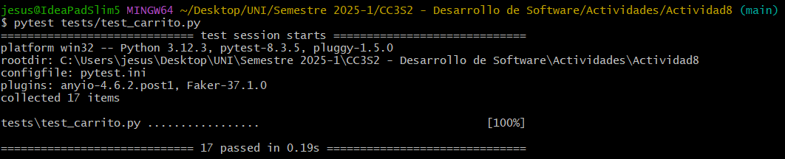
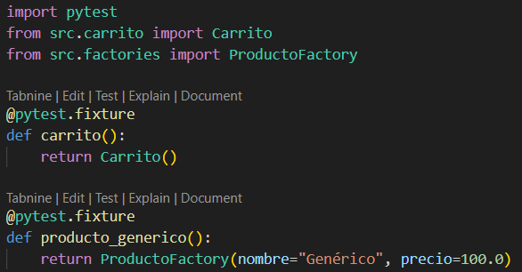
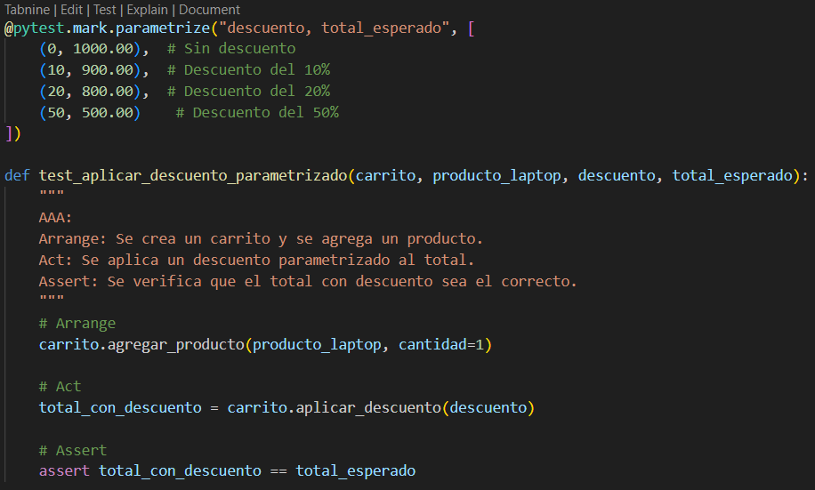

# Actividad 8

## Ejercicio 1

- Agregamos el método `vaciar` en la clase `Carrito`.

    

- Creamos pruebas que invoquen este nuevo método y luego lo testeamos.

    

    

## Ejercicio 2

- Agregamos un nuevo método `aplicar_descuento_condicional` en la clase `Carrito`.

    

- Creamos pruebas que validen condición cumplida y no cumplida.

    

    
   
## Ejercicio 3

- Modificamos la clase `Producto` añadiendo un nuevo atributo que sea `stock` y actualizamos `factories.py` también para que genere un stock aleatorio.

    

    

- En `Carrito.agregar_producto`, antes de agregar o incrementar la cantidad, verificamps que la suma de cantidades en el carrito no supere el stock del producto.

    

- Creamos pruebas que verifiquen estas implementaciones.

    

    

## Ejercicio 4

- Agregamos un método que devuelva la lista de items ordenados por criterios definidos.

    

- Creamos pruebas que verifiquen esto.

    

    

## Ejercicio 5

- Creamos un archivo `conftest.py` donde creamos fixtures que se reutilizaran en instancias comunes de `Carrito` o de productos. Como un fixture para un carro vacío o para un producto genérico.

    

- Creamos un fixture para cada producto creado en `test_carrito.py` y luego lo sustituimos en dicho archivo.

    

- Acá un ejemplo de como es sustituido por el fixture de `producto_laptop`

    

- Luego comprobamos que los test funcionan sin problemas.

    

## Ejercicio 6

- Utilizamos la marca `@pytest.mark.parametrize`, para parametrizar pruebas para `aplicar_descuento`

    

- Creamos su prueba y veremos que siendo solo un test se aplican como si fueran 4 en uno solo.

    

- Ahora usamos la marca para `actualizar_cantidades`

    

- Vemos lo mismo para las pruebas de este.

    

## Ejercicio 7

- Creamos un nuevo archivo de pruebas `tests/test_impuestos.py`

    

- Si hacemos la prueba en este punto fallará, ya que aún no se implementa el método `calcular_impuestos`.

    

- Agregamos el método `calcular_impuestos`.

    

- Y vemos que ahora si ejecutamos la prueba si pasará.

    

## Ejercicio 8

- Creamos un nuevo archivo de pruebas `tests/test_cupón.py`.

    
    
- Implemantamos el método `aplicar_cupon`.

    

- Ejecutamos las pruebas.

    

## Ejercicio 9

- Creamos un nuevo archivo de pruebas `tests/test_stock.py`.

    
    
- Implemantamos el método `_busar_item` y `agregar_producto`.

    

- Ejecutamos las pruebas.

    

Ejecutamos pruebas y generamos el reporte de cobertura.

O bien generamos un reporte HTML.

