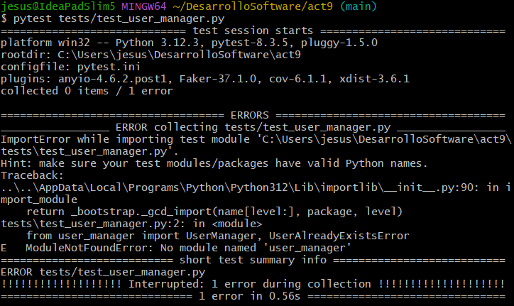
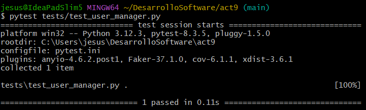
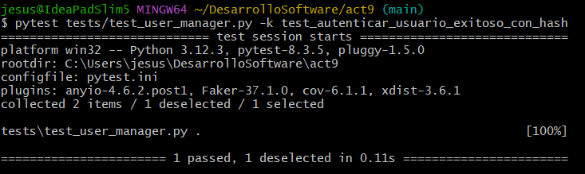
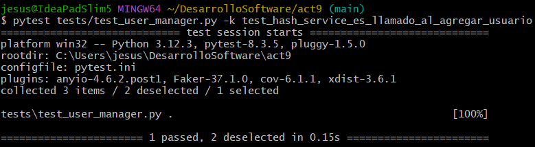
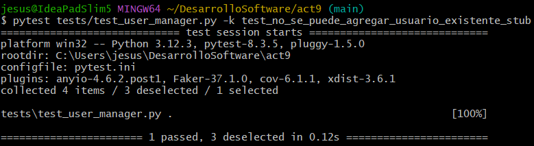
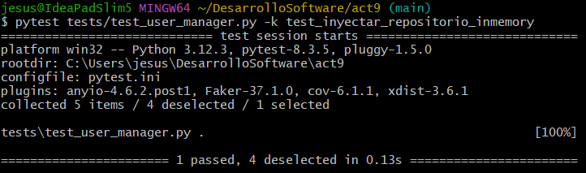
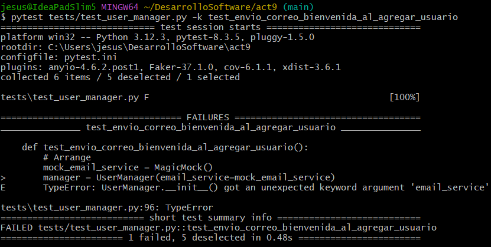

# Ejercicio 

Desarrolla las 6 iteraciones de Desarrollo Guiado por Pruebas (TDD) (Red-Green-Refactor) aplicadas a la clase UserManager, incluyendo casos de mocks, stubs, fakes, spies e inyección de dependencias.

## Iteración 1: Agregamos usuario

Creamos una prueba que verifique que podemos agregar un usuario con éxito.

```python
import pytest
from user_manager import UserManager, UserAlreadyExistsError

def test_agregar_usuario_exitoso():
    # Arrange
    manager = UserManager()
    username = "diegoste"
    password = "securepassword"

    # Act
    manager.add_user(username, password)

    # Assert
    assert manager.user_exists(username), "El usuario debería existir después de ser agregado."
```

Al ejecutar la prueba fallará ya que aún no implementamos la clase `UserManager`



Ahora implementamos la clase `UserManagar` donde se hará el registro básico de usuarios y prevenimos duplicados mediante validación. Ya implementado la clase la prueba anterior debe pasar.



## Iteración 2: Autenticación de usuario

En esta iteración aseguramos contraseñas usando `hashing` (hashing es un proceso criptográfico que transforma datos de entrada en una cadena de caracteres de longitud fija, conocida como hash. Este proceso es unidireccional, lo que significa que no se puede revertir para obtener los datos originales.) 

Verificamos que `UserManager` autentica correctamente a un usuario con la contraseña adecuada. Asumimos que la contraseña se almacena en hash.

Definimos una nueva prueba en `test/test_user_manager.py`
```python
def test_autenticar_usuario_exitoso_con_hash():
    # Arrange
    hash_service = FakeHashService()
    manager = UserManager(hash_service=hash_service)

    username = "usuario1"
    password = "mypassword123"
    manager.add_user(username, password)

    # Act
    autenticado = manager.authenticate_user(username, password)

    # Assert
    assert autenticado, "El usuario debería autenticarse correctamente con la contraseña correcta."
```

Y modificamos `src/user_manager.py` donde inyectamos un servicio de hashing.
```python
 def __init__(self, hash_service=None):
        """
        Si no se provee un servicio de hashing, se asume un hash trivial por defecto
        (simplemente para no romper el código).
        """
        self.users = {}
        self.hash_service = hash_service
        if not self.hash_service:
            # Si no pasamos un hash_service, usamos uno fake por defecto.
            # En producción, podríamos usar bcrypt o hashlib.
            class DefaultHashService:
                def hash(self, plain_text: str) -> str:
                    return plain_text  # Pésimo, pero sirve de ejemplo.

                def verify(self, plain_text: str, hashed_text: str) -> bool:
                    return plain_text == hashed_text

            self.hash_service = DefaultHashService()

```

Ejecutamos la prueba y debe pasar.



## Iteración 3: Verificación con Mocks

Nos aseguraremos de que cada vez que `add_user` es llamado se invoque el método `hash` de nuestro servicio hashing. Para esto, usaremos un mock que "espía" si se llamó el método y con que parámetros.

Ahora importamos `unittest.mock` para crear un mock.
```python
from unittest.mock import MagicMock

def test_hash_service_es_llamado_al_agregar_usuario():
    # Arrange
    mock_hash_service = MagicMock()
    manager = UserManager(hash_service=mock_hash_service)
    username = "spyUser"
    password = "spyPass"

    # Act
    manager.add_user(username, password)

    # Assert
    mock_hash_service.hash.assert_called_once_with(password)
```

Como nuestra clase `UserManager` ya llama a `hash_service.hash`, la prueba implementada debería pasar sin problemas.



## Iteración 4: Stubs para Casos Específicos 

En esta iteración reforzamos la prueba para el caso de usuario duplicado. Ya tenemos la excepción `UserAlreadeExistsError`, pero usaremos _stubs_ para hacer una prueba más compleja.

```python
def test_no_se_puede_agregar_usuario_existente_stub():
    # Este stub forzará que user_exists devuelva True
    class StubUserManager(UserManager):
        def user_exists(self, username):
            return True

    stub_manager = StubUserManager()
    with pytest.raises(UserAlreadyExistsError) as exc:
        stub_manager.add_user("cualquier", "1234")

    assert "ya existe" in str(exc.value)
```

Para que esta prueba pase, modificamos el método `add_user` en la clase `UserManager`

- Acá el stub sobrescribre `user_exits()` para devolver `True`, pero `add_user()` ignoraa el stub porque verificaba `username in self.users` directamente.
    ```python
    def add_user(self, username, password):
            if username in self.users:
                raise UserAlreadyExistsError(f"El usuario '{username}' ya existe.")
    ```
- Ahora `add_user()` llama a `user_exists()`, que es el método sobrescrito por el stub, como el stub siempre devuelve `True`, se lanzará la excepción correctamente.
    ```python
    def add_user(self, username, password):
            if self.user_exists(username):  
                raise UserAlreadyExistsError(f"El usuario '{username}' ya existe.")
    ```

Luego de esta modificación nuestra prueba debe pasar.


## Iteración 5: Fake repository

Creamos unas prueba que verifique que podemos inyectar un repositorio y que `UserManager` lo use.

```python
class InMemoryUserRepository:
    """Fake de un repositorio de usuarios en memoria."""
    def __init__(self):
        self.data = {}

    def save_user(self, username, hashed_password):
        if username in self.data:
            raise UserAlreadyExistsError(f"'{username}' ya existe.")
        self.data[username] = hashed_password

    def get_user(self, username):
        return self.data.get(username)

    def exists(self, username):
        return username in self.data

def test_inyectar_repositorio_inmemory():
    repo = InMemoryUserRepository()
    manager = UserManager(repo=repo)  # inyectamos repo
    username = "fakeUser"
    password = "fakePass"

    manager.add_user(username, password)
    assert manager.user_exists(username)
```

Luego modificamos `src/user_manager.py`, agregando un nuevo parámetro y definimos un nuevo método. Con esto reemplazamos almacenamiento en memoria y simulamos base de datos reales.

```python
def _default_repo(self):
        # Un repositorio en memoria muy básico
        class InternalRepo:
            def __init__(self):
                self.data = {}
            def save_user(self, username, hashed_password):
                if username in self.data:
                    raise UserAlreadyExistsError(f"'{username}' ya existe.")
                self.data[username] = hashed_password
            def get_user(self, username):
                return self.data.get(username)
            def exists(self, username):
                return username in self.data
        return InternalRepo()
```

E implementado esto, la prueba debe pasar.



## Iteración 6: Spy para Servicios Externos

Agregamos una funcionalidad que cada vez que se agrega un usuario, se envíe un correo de bienvenida. Para probar esto usamos Spy o Mock que verificará si se llamó el nuevo método implementado.

Implementamos una prueba para esta nueva función.



Modificamos `src/user_manager.py`, al método `__init__` le agregamos un nuevo parámetro e inyectamos el servicio de correo:
```python
def __init__(..., ..., ..., email_service=None)
    self.email_service = email_service 
```
Y al método `add_user`:
```python
if self.email_service:
            self.email_service.send_welcome_email(username)
```

