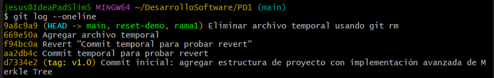

# Práctica Dirigida 1

1. **Descargamos el archivo `git_workflow.sh` y ejecutamos el script con un repositorio clonado.**
    
    

2. **Verificamos el contenido de nuestro archivo `README.md`, luego le agregamos una línea adicional para que al usar `git diff` veamos la diferencia entre el archivo original y lo que acabamos de modificar. Hacemos un `git stash` para guardar temporalmente los cambios y regresar al estado limpio que estábamos. Por último, con `git stash pop` recuperamos los cambios hechos y elimina nuestra etiqueta de `git stash.`**

    
    *Con* `git diff` *podemos comparar los cambios hechos en cualquier tipo de archivo.*

3. **Revisamos como va nuestro historial de commits hasta ahora.**

    

- Ahora usando `git blame` identificamos quien agregó o hizo cambios en cada línea del documento.

    

4. **Hacemos cambios en nuestro archivo README.md y le hacemos commit. Verificamos que nuestro commit salga en nuestro historial. Usamos `git revert` con el hash de este último commit para revertirlo y mostrando nuevamente el historial vemos que el último commit realizado ya no está como primero si no el mismo nombre del commit con `Revert` al inicio.**

    

5. **Creamos un archivo temporal para probrar el uso de `git rm`, vemos que con este comando colocando el nombre del archivo se elimina y está listo para el commit. Luego del commit vemos con `git status` que no hay nada por agregar.**

    

- Ahora tambien existe solamente `rm` y lo que hace este comando es casi similar, la diferencia con el comando anterior es que `rm` elimina el archivo localmente y Git no lo "marca" automáticamente para eliminar.

    Creamos y agregamos nuevamente un archivo temporal. Ejecutamos `rm` con el nombre del archivo.
    

    Vemos con `git status` que nos falta hacer `git add` y `git commit`. Luego de hacerlo vemos que ahora si Git detecta el archivo eliminado.
    
    
    
    
6. **Creamos una nueva rama y desde esa nueva rama modificamos el archivo README.md, le haces commit y seguidamente `git reset --soft` etiquetando `HEAD ~1` haciendo referencia al último commit realizado, vemos que con este comando se deshacerá el último commit.**

    

- Ahora, `git reset` a pesar de deshacer el último commit los cambios no se eliminan y estarán en el área de staging, listos para ser commiteados nuevamente.

    

7. ****

2. ****

2. ****