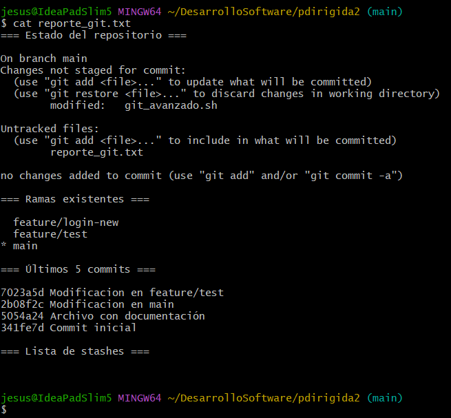

# Practica Dirigida 2

## Procedimiento de la actividad

### 1. Inicio del script
- Previamente le asignamos permiso al script con el comando `chmod +x git_avanzado.sh`. Y lo ejecutamos con `./git_avanzado.sh`.

    

### 2. Agregamos un submódulo

- Ingresamos a la opción 2, colocamos un URL de un repositorio para el submódulo y escribimos el directorio donde se guardará el submódulo.

    

### 3. Gestión de ramas

- Regresamos al menú principal y colocamos la opción 4. Ingresando a `a` nos muestra la lista de ramas, luego creamos una nueva rama ingresando a `b` `feature/login`.

    

### 4. Gestión de git diff

- Seleccionamos la opción 9 y en el menú ingresamos a `c` para comparar 2 revisiones. Para esto tenemos que salir del script interactivo y hacemos un cambio en el archivo `README` desde la rama `feature/login` para ver los cambios.

    

### 5. Gestión de hooks

- Creamos un hook pre-commit

    

## Preguntas

- **¿Qué diferencias observas en el historial del repositorio después de restaurar un commit mediante reflog?**

    Vemos que al restaurar un commit mediante reflog desaparece de la lista de los commits, pero esto no quiere decir los borra sino que los desvincula de la rama y pueden ser accesibles temporalmente desde el git reflog.

    

- **¿Cuáles son las ventajas y desventajas de utilizar submódulos en comparación con subtrees?**

    - Los submódulos nos permiten mantener dependencias completamente separadas(repositorios independientes), también cada submódulo apunta a un commit exacto lo que nos garantiza versiones fijas. Sin embargo, necesita ejecutar comandos adicionales(`git submodule init` y `git submodule update`), los cambios en el submódulo no se registran automáticamente en el repositorio principal y también podría confundir a los colabarodores que no están familiarizados con submódulos.

    - Los subtrees son más sencillos de usar ya que no necesita comandos adicionales, su contenido esta integrado dentro del repositorio principal. Pero su historial externo se mezcla con el del proyecto principal a menos que usemos --squash y tambien las actualizaciones del subtree requieren comandos más avanzados.

- **¿Cómo impacta la creación y gestión de hooks en el flujo de trabajo y la calidad del código?**

    La creación y gestión de hooks permite ejecutar acciones automáticamente, como formatear código, validar convenciones o ejecutar pruebas antes de hacer commit o push. Un pre-commit nos ayuda a evitar que se suba código sin pruebas o con errores de estilo. 
    Tambien nos ayuda a correr test antes de confirmar cambios, esto hace que disminuya la posibilidad de que lleguen errores a la rama principal.

- **¿De qué manera el uso de git bisect puede acelerar la localización de un error introducido recientemente?**

    El comando `git bisect` emplea una búsqueda binaria para localizar el commit que introdujo un error determinado.

    - Primero indica al sistema el commit *bueno* y el commit *malo*.
    - Git elige automáticaente un commit intermedio para probarlo.
    - El desarrollador prueba ese commit para marcarlo como *bueno* o *malo*.
    - Y el proceso se repite hasta aislar el commit problemático.

    Para el paso 3 se puede hacer con un `./run_tests.sh` que es un proceso más interactiv, donde si el test falla, marca el commit *malo* automáticamente.

- **¿Qué desafíos podrías enfrentar al administrar ramas y stashes en un proyecto con múltiples colaboradores?**

    Nos podríamos enfrentar a:

    - Conflictos de fusión si varios colaboradores han realizado cambios en las mismas partes del código en diferentes ramas.
    - Falta de sincronización si no se actualiza con frecuencia las ramas locales.
    - Gestión de stashes ya que pueden acumularse y volverse difíciles de rastrear si no son bien descritos o no se eliminan luego de usarlos.
    - Confusión en ramas al no saber cuales están activas o cual es su propósito.
    - Falta de comunicación entre colaboradores para los cambios realizados en sus ramas o stashes. 

## Ejercicios

### 1. Extendemos el menú de gestión de ramas para incluir la funcionalidad de renombrar ramas.

### 2.  Ampliamos la sección de "Gestión de git diff" para permitir ver las diferencias de un archivo específico entre dos commits o ramas.

### 3. Creamos una función que permita instalar automáticamente un hook que verifica si se han agregado comentarios de documentación en cada commit.
- pre-commit instalado que verifica la documentación

    
- Ejemplo de como funciona:

    

### 4. Implementamos una opción en el script que realice un merge automatizado de una rama determinada en la rama actual, incluyendo la resolución automática de conflictos (siempre que sea posible).

### 5. Implementamos una opción en el script que genere un reporte con información relevante del repositorio (estado, ramas, últimos commits, stashes, etc.) y lo guarde en un archivo.
- Reporte generado en el archivo `reporte_git.txt`.

- Visualización del archivo.

