# Práctica Dirigida 3

## Herramientas del shell

1. Escribimos un comando `ls` que liste los archivos.

    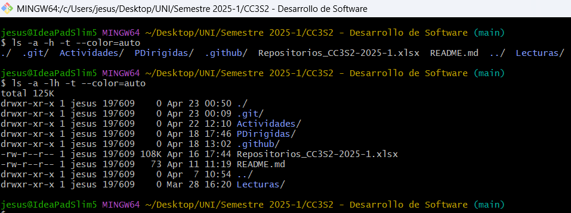

    - Donde `-a` es para mostrar todos los archivos incluido los ocultos. 
    - `-lh:` `l` muestra los archivos en una lista y `h` muestra los tamaños de los archivos de manera legible para los humandos.

    - `-t:` Ordena los archivos por fecha de modificación.
    - `--color=auto:` Habilita la colaración de la salida si es compatible con la terminal.

## Bash

### Paso 1 - Verificamos la versión de Bash:

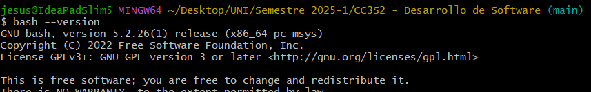

### Paso 2 - Nuestro 1er script:

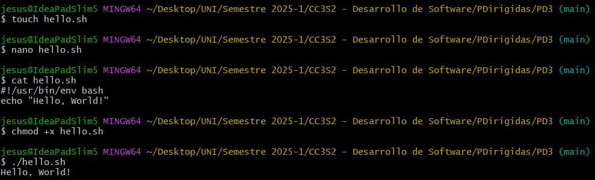

### Paso 3 - Script donde asignamos variables:

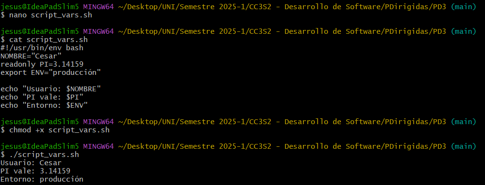

### Paso 4 - Script para párametros posicionales:

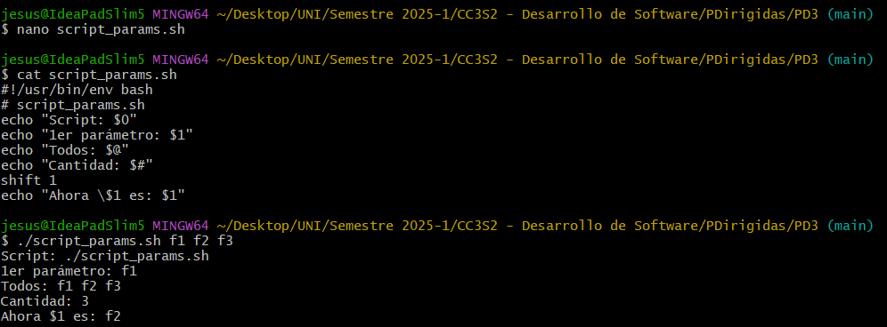

### Paso 5 - Arrays en Bash:

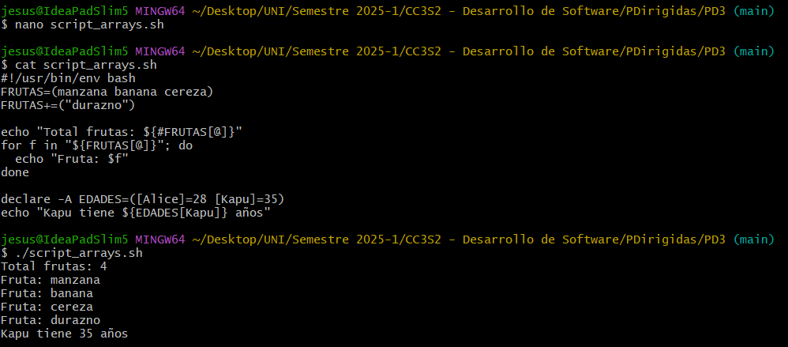

### Paso 6 - Expansiones en bash.

- Expansión aritmética

    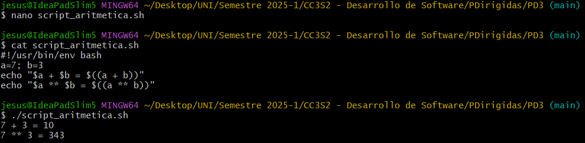

- Sustitución de comandos

    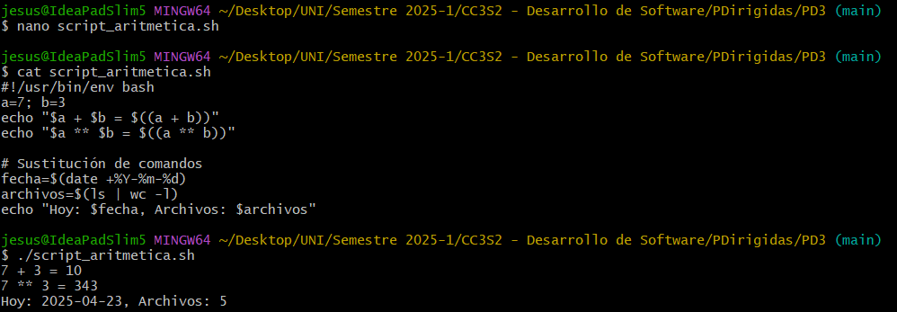

- Otras expansiones

    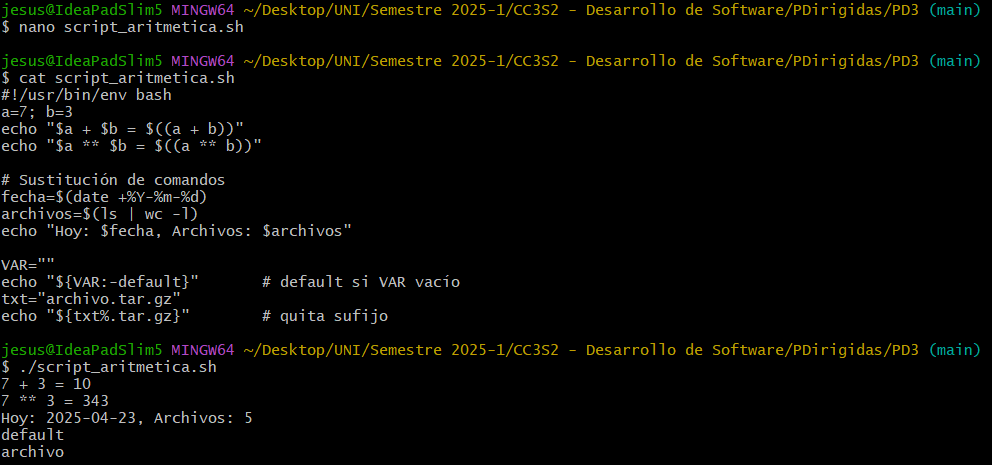

### Paso 7 - Pipes y redirección

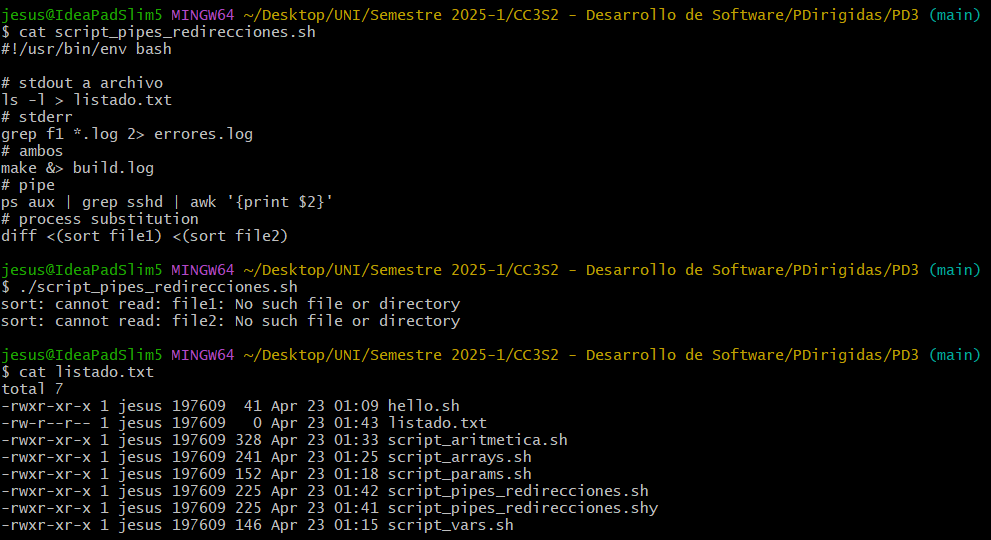

### Paso 8 - Condicionales en bash

- Condicional `if`

    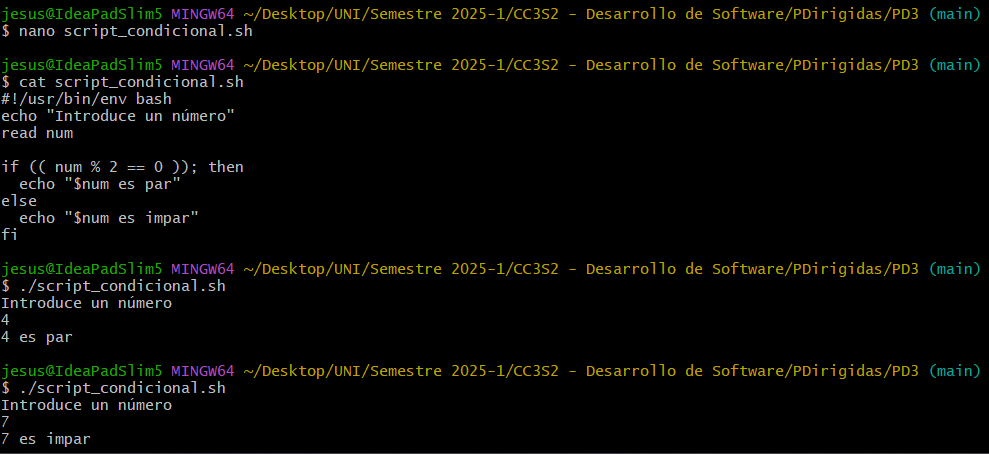
   
- Condicional `case`

    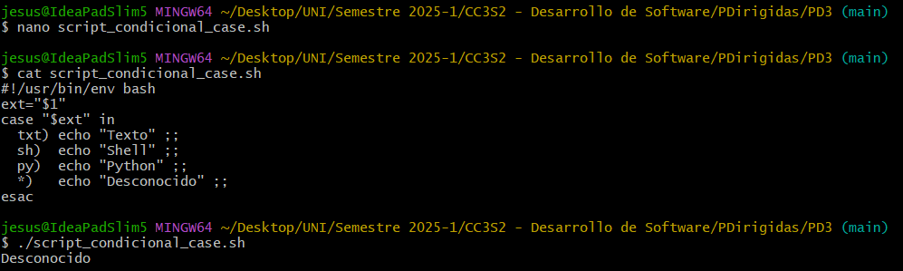

### Paso 9 - Bucles en Bash:

- Bucle `for` y `while`

    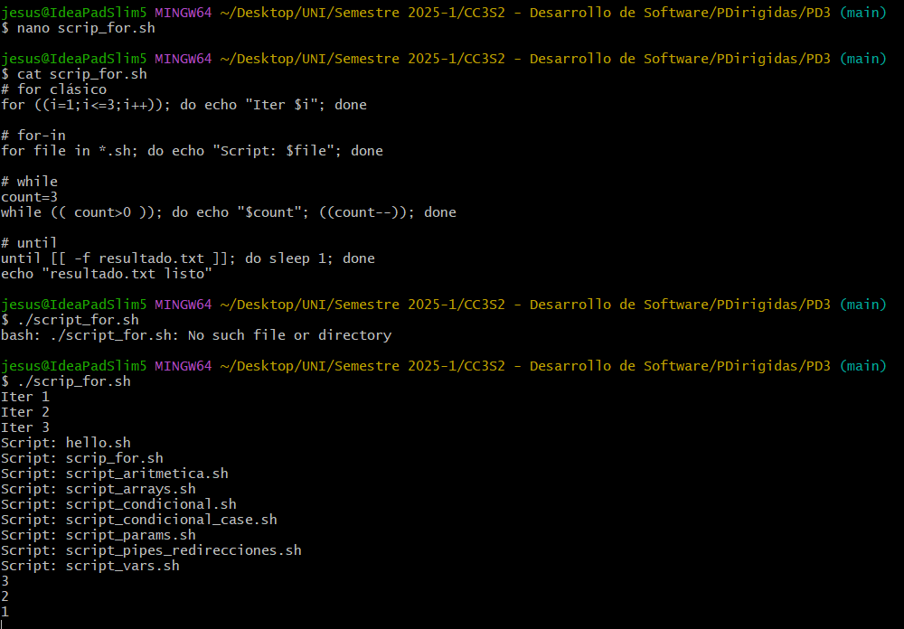

### Paso 10 - Funciones en Bash:

- Dos funciones, uno de imprimir un array y otro de dividir.

    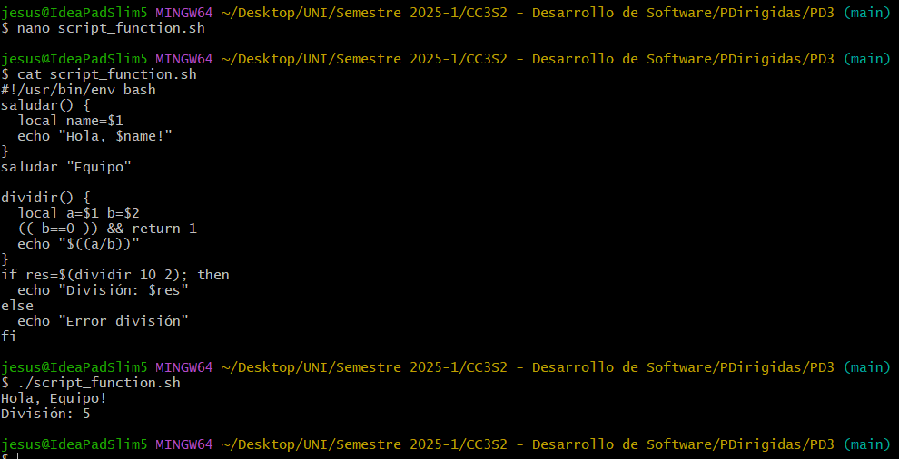

### Paso 11 - Depuración en Bash:

- Este código es útil para depurar script complejos, ayuda a identificar rápidamente dónde ocurren los errores.

    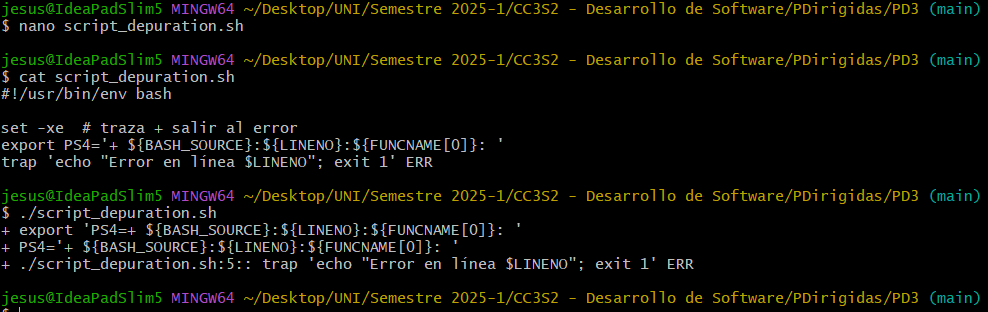